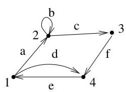
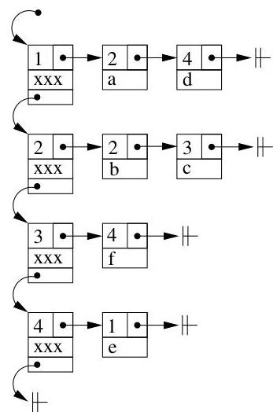
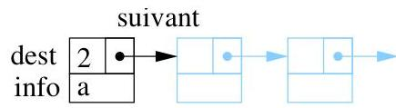
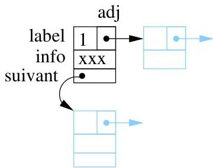

V.2. Listed adjacency




FIGURE V.4. Implementation d'un graphe.

```txt
struct eltadj
{
int dest;
int info;
struct eltadj *suivant;
};
```


FIGURE V.5. Le type eltadj.

des sommets qui lui sont adjacents. La figure V.6 reprend schématiquement une liste chainee de sommets.

```txt
struct sommet {
int label;
int info;
struct sommet *suivant;
struct eltadj *adj;
};
```


FIGURE V.6. Le type sommet.

Enfin, la structure graphe est principalement un pointeur vers un sommet (premierSommet). Les autres champs de la structure permettent de stocker quelques informations utiles comme le nombre de sommets ou d'arcs du graphe ainsi qu'un pointeur vers le dernier sommet de la liste chainee. Dans de nombreuses procédures, les sommets recoivent un indice. La variable maxS stocke le plus grand indice qui a ete attribué a un sommet du graphe. Ainsi, en attribuant a un nouveau sommet l'indice maxS+1, on est