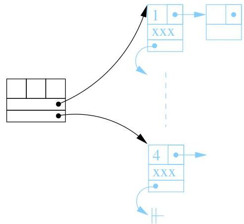

Chapitre V. Annexe : implémentation en C

certain que cet indice n'est pas déjà employé. La figure V.7 reprend schématiquement la structure de graphe.

```c
struct graphe {
int nbS;
int nbA;
int maxS;
struct sommet *premierSommet;
struct sommet *dernierSommet;
};
```


FIGURE V.7. Le type graphe.

2.1. Une manipulation simplifiée. Nous mettons à la disposition du lecteur une série de fonctions préprogrammées pour faciliter la manipulation des graphes et se concentrer principalement sur les algorithmes relevant de ce cours.

void initialiserGraphe(GRAPHE\*);

On transmet à cette fonction l'adresse d'une variable de type GRAPHE. La variable correspondante sera initialisée au graphe vide.

int ajouterSommet(GRAPHE *, int info);

On transmet à cette fonction l'adresse d'une variable de type GRAPHE et un entier. Le champ maxS est incrémenté d'une unité, un sommet de label maxS (après incrémentation) est ajouté au graphe en fin de liste et ce sommet porte l'information info fournie en argument.

|  Erreur | -1 | si l'allocation de mémoire n'est pas possible  |
| --- | --- | --- |

int ajouterArc(GRAPHE *, int a, int b, int info);

Crée un nouvel arc du sommet de label a vers le sommet de label b avec l'information supplémentaire donnée par info. Les arcs sont rangés dans la liste d'adjacence par indice croissant. Si un arc entre a et b existe déjà, le champ info est mis à jour sans créé de nouvel arc dans la liste d'adjacence. Cette fonction ne renvoie rien.

|  Erreur | -1 | si a n'existe pas  |
| --- | --- | --- |
|   |  -2 | si b n'existe pas  |
|   |  -3 | si l'allocation de mémoire n'est pas possible  |