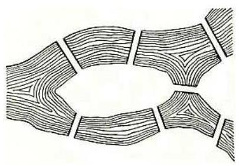
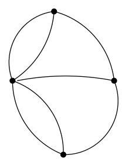
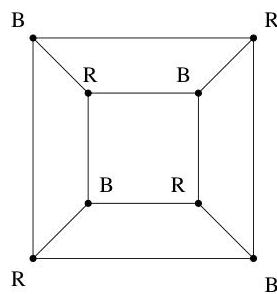
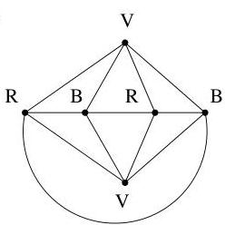

I.3. Quelques exemples

FIGURE I.12. Les sept points de Königsberg.

dual" de l'exemple précédent (on s'intéresse ici à trouver un circuit passant une et une seule fois par chaque sommet et non par chaque arête). Oncherche un circuit permettant non seulement de relier  $n$  villes en passant une et une seule fois par chacune d'entre elles, mais de plus, ce circuit doit minimiser la distance totale parcourue. On pourrait par exemple considérer les villes belges et les données de la figure I.10 et en déterminer un circuit optimal. Dans certains cas, on a recours à un graphe orienté plutôt qu'à un graphe non orienté comme à la figure I.10. Cela a pour avantage de permettre la modélisation de coûts différents pour aller d'un sommet  $A$  à un sommet  $B$  plutôt que de  $B$  à  $A$  (ceci permet, par exemple, de prendre en compte des sens uniques, des payages, des temps de transports différents suivant la direction choisisie, etc...).

Il s'agit donc de problèmes typiques rencontres dans la détermination de tournées, de circuits de distribution, etc...

Exemple I.3.3 (Coloriage). Considerons un cube. Si chaque sommet (resp. chaque arête) d'un graphe représentée un sommet (resp. une arête) du cube, on obtient le graphe de gauche de la figure I.13, on parle du squelette du cube. Par contre, si on représentée les faces du cube par les sommets d'un graphe et si les sommets du graphe correspondant à des faces du cube ayant une arête commune sont adjacents, on obtient celui de droite. On peut alors

FIGURE I.13. Deux représentations d'un cube.

poser la question générale de déterminer le nombre de couleurs nécessaire et suffisant pour colorier les sommets d'un multi-graphe donné, de manière telle que deux sommets adjacents ne recoivent pas la même couleur. Si on