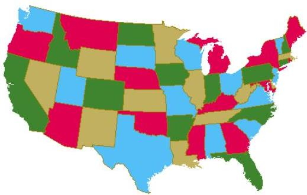
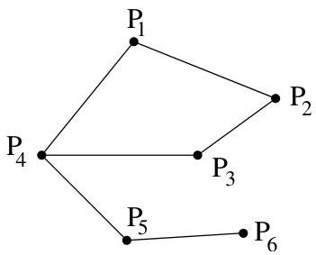

Chapitre I. Premier contact avec les graphes

répond à cette question dans le cas de notre exemple initial, on s'aperçoit que pour colorier les sommets (resp. les faces d'un cube), deux (resp. trois) couleurs sont suffisantes.

Example I.3.4 (Cartographie). Quel est le nombre minimum de couleurs nécessaires pour colorier les pays d'une carte $^6$  géographique de manière telle que des couleurs distinctes soient attribuées à des pays voisins? Ce problème

FIGURE I.14. La carte des USA.

se ramène au précédent. On considère un graphe ayant pour sommet les différents pays de la carte. Deux sommets sont adjacents si et seulement si ils partagent une frontière.

Example I.3.5 (Graphe d'incompatibilité). Pour le transport de produits chimiques par rail, certains de ces produits ne peuvent être transportés dans un même wagon (des produits co-combustibles sont placés dans des wagons distincts). La figure I.15 représenté le graphe d'incompatibilité de transport (deux sommets adjacents ne peuvent être placés dans le même wagon). On

FIGURE I.15. Graphe d'incompatibilité.

Par rapport à l'exemple précédent, le graphe n'est pas nécessairement planaire.

demande de minimiser le nombre de wagons nécessaires au transport. Ce problème se ramène donc à un problème de coloriage. Deux sommets adjacents doivent avoir des couleurs distinctes, une couleur correspondant à un wagon.