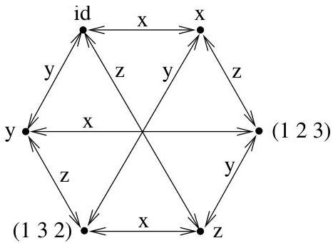

I.3. Quelques exemples

Exemple I.3.6 (Coloriage d'arêtes). Au lieu de pouvoir colorier les sommets d'un multi-graphe, on peut aussi s'intéresser au problème suivant. Déterminer le nombre de couleurs nécessaires et suffisantes pour colorier les arêtes d'un multi-graphe donné, de manière telle que deux arêtes adjacentes ne recoivent pas la même couleur.

Exemple I.3.7 (Graphe de Cayley). Soit  $G$  un groupe et  $S$  un ensemble de générateurs de  $G$  (tout élément de  $G$  s'obtient comme produit d'un nombre fini d'éléments de  $S$  ou d'inverses d'éléments de  $S$ ). Le graphe de Cayley du groupe  $G$  (par rapport à  $S$ ) est un graphe orienté  $\mathcal{C}_S(G)$  ayant pour sommets les éléments de  $G$ . Ses arcs sont définis comme suit. Pour tous  $g \in G$ ,  $s \in S$ , l'arc  $(g, gs)$  est un arc du graphe ayant  $s$  pour label. Soit le groupe symétrique  $S_3$  des permutations à 3 éléments ayant pour ensemble générateur

$$
S = \{x = (1 2), y = (1 3), z = (2 3) \}.
$$

Il est clair que

$$
x x = y y = z z = i d, \quad x y = (1 2) (1 3) = (1 3 2),
$$

$$
x z = (1 \quad 2) (2 \quad 3) = (1 \quad 2 \quad 3), \quad y z = (1 \quad 3) (2 \quad 3) = (1 \quad 3 \quad 2)
$$

et

$$
y x = (1 \quad 2 \quad 3), z x = (1 \quad 3 \quad 2), z y = (1 \quad 2 \quad 3).
$$

Le graphe de Cayley correspondant est représenté à la figure I.16.

FIGURE I.16. Graphe de Cayley de  $S_{3}$

On peut obtenir un autre graphe de Cayley de  $S_{3}$  en considérant comme ensemble de générateurs  $\{a = (1\quad 2\quad 3), b = (1\quad 2)\}$ . On obtient alors le graphe de la figure I.17 (les détails de calcul sont laissés au lecteur). Bien évidemment, le graphe de Cayley d'un groupe ne donne aucun renseignement qui ne saurait être obtenu sous une forme "algébrique" classique. Néanmoins, un tel diagramme a l'avantage de fournir presque immédiatement certaines informations qui seraient plus pénibles à obtenir par d'autres moyens (imaginez un groupe défini par certaines relations, par exemple,  $cd = dc$ ,  $c^2 dc = d$ , etc...). Ainsi, il est ici immédiat de vérifier sur la figure I.17 que les éléments