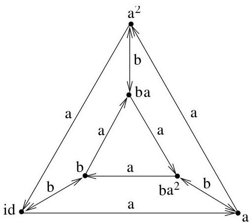
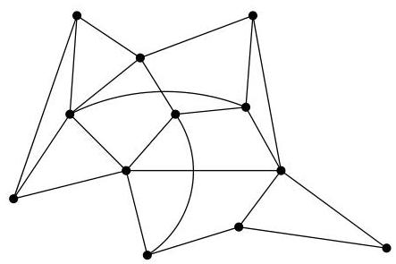
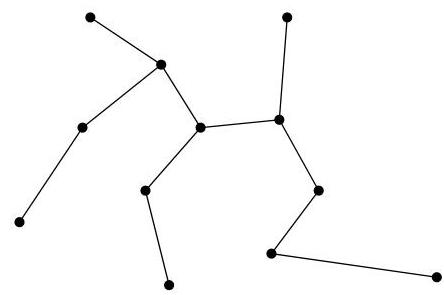

Chapitre I. Premier contact avec les graphes

FIGURE I.17. Un autre graphe de Cayley de  $S_3$ .

baaba et  $a^2$  sont identiques (il suffit de suivre les labels de chemins depuis id). L'utilisation des graphes de Cayley se révèle être un outil souvent bien utile en théorie des représentations ou dans la résolution de problèmes précis à l'aide de l'ordinateur.

Example I.3.8 (Arbre couvrant). Une société de téléphonie souhaite cabler entièrement, au moyen de nouvelles fibres optiques, une ville en minimisant le nombre de connexions à réaliser. Le nouveau cablage s'appuie sur le réseau électrique déjà existant et bien évidemment, tous les points de la ville doivent être déservis. La figure I.20 représenté le réseau actuel de la ville et ses connexions. A droite, se trouve les sélections envisagées. La question générale

FIGURE I.18. Sous-graphe couvrant.

qui est posée est de rechercher un sous-graphe (ou un sous-arbre) couvrant dans un graphe donné. On peut aussi envisager une version pondérée dans laquelle chaque arc aurait un coût et on rechercherait un sous-graphe (ou un sous-arbre) couvrant de poids minimal.

Example I.3.9 (Forte connexité). Suite à divers problèmes de circulation, des responsables communaux désirant placer les rues d'un quartier à sens unique. Si un graphe modélise les rues et leurs croisements, la question qui se pose est donc d'orienter les arcs d'un graphe non orienté de manière telle