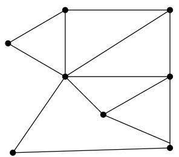
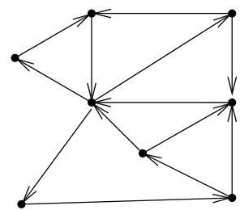

I.3. Quelques exemples

qu'il existe un chemin orienté entre toute paire de sommets. Un tel exemple est donné à la figure I.19.


FIGURE I.19. Orientation d'un graphe.



Exemple I.3.10 (Distance). Considérons le problème de routage de paquets de données devant transiter sur un réseau (du type internet). Si un utilisateur désire acceder au contenu d'une page web présente sur un serveur, une connexion entre ce serveur et la machine doit être établie. Cette connexion n'est en général pas directe mais doit passer par une série de machines relais. Pour préserver la bande passante, pour accélérer le transfert ou encore pour minimiser les coûts, on essaie de minimiser le nombre de "hops" (i.e., le nombre de machines relais utilisées). Si chaque ordinateur, routeur, passerelle ou serveurprésents sur l'internet représentée un sommet d'un graphe dont les arcs représentent les connexions entre ceux-ci, il s'agit d'un problème délicat! Voici un exemple de "route" suivie par un paquet de données :

```txt
&gt; traceroute www.google.be
traceroute to www.google.be (66.249.85.99), 30 hops max, 40 byte packets
1 mont3-0014.gw.ulg.ac.be (139.165.159.1) 0.177 ms 0.177 ms 0.163 ms
2 segi3-0813-mont3.gw.ulg.ac.be (193.190.228.125) 0.221 ms 0.179 ms 0.184 ms
3 inet3-3031.gw.ulg.ac.be (139.165.192.49) 0.734 ms 0.612 ms 0.597 ms
4 fe.m20.access.liege.belnet.net (193.191.10.17) 0.791 ms 0.707 ms 0.713 ms
5 oc48.m160.core.science.belnet.net (193.191.1.185) 2.266 ms 2.239 ms 16.679 ms
6 oc192.m160.ext.science.belnet.net (193.191.1.2) 2.252 ms 2.260 ms 2.235 ms
7 216.239.43.88 7.954 ms 7.922 ms 7.731 ms
8 64.233.175.249 14.932 ms 14.906 ms 14.911 ms
9 216.239.46.49 14.628 ms 14.431 ms 14.407 ms
10 66.249.85.99 14.409 ms 14.722 ms 14.624 ms
```

Le problème général sous-jacent est donc de déterminer, dans un graphe donné, le chemin le plus court permettant de relier deux sommets quelconques d'un graphe. On pourra envisager des variantes pondérées ou orientées. Dans la version pondérée, on recherchera le chemin de poids minimal.

Example I.3.11 (Planarité). Lors de l'élaboration de circuits électriques, les connexions reliant les différents composants ne peuvent se toucher sous peine de court-circuit. La question de théorie des graphes qui est posée est donc de déterminer si, dans le plan, il existe une configuration géométrique des sommets et des arcs du graphe assurant qu'aucune paire d'arcs ne se