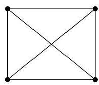
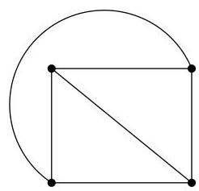
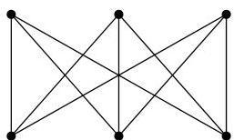
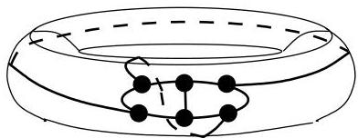

Chapitre I. Premier contact avec les graphes

FIGURE I.20. Un graphe planaire.

croise. Si tel est le cas, on parle de graphe planaire. Plutôt que de représentier un graphe dans un plan, on pourrait aussi imaginer des représentations sur une sphère ou un tore et se poser la même question. Ainsi, le graphe  $K_{3,3}$  de la figure I.21 n'est pas planaire (cf. Lemme III.4.2), mais si on le représentée sur un tore, on peut obtenir une représentation dont les arcs ne se coupent pas (cf. figure I.22). Notons enfin que, dans l'élaboration des circuits

FIGURE I.21. Un graphe non planaire.

FIGURE I.22.  $K_{3,3}$  sur un tore.

imprimés (VLSI $^8$  par exemple), il est possible de réaliser de tels circuits sur plusieurs couches. Ainsi, un autre problème serait de déterminer le nombre minimum de couches à envisager pour la conception du circuit imprimé.

Remarque I.3.12. Le graphe de la figure I.21 est classiquement illustré par le problème des trois villas et des trois usines. Imaginez que trois villas doivent être reliées au gaz, à l'eau et à l'électricité. Est-il possible de construire des canalisations alimentant chaque villa depuis chaque usine de manière telle que ces canalisations ne se chevauchent pas?

Example I.3.13 (Graphe d'intervalles). Considérons les intervalles ouverts  $]0,2[, ]1,4[, ]2,5[, ]3,4[, ]3,8[$  et  $]6,8[$ . A chaque intervalle correspond un sommet d'un graphe non orienté. Si  $]a,b[\cap ]c,d[\neq \emptyset$ , alors une arête relié dans le graphe les sommets correspondant à ces deux intervalles. Le graphe