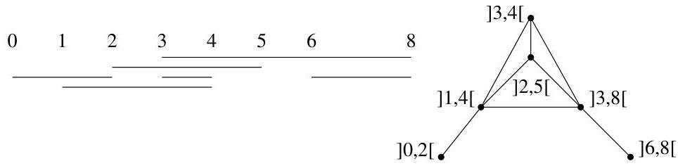
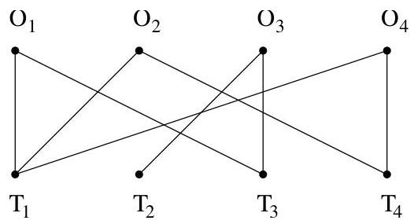

I.3. Quelques exemples

d'intervalles correspondant aux intervalles donnés ci-dessus est représenté à la figure I.23. Ces graphes sont parfois utilisés en archéologie ou encore en

FIGURE I.23. Graphe d'intervalles.

génétique pour exprimer ou mettre en évidence des éléments communs se produit à travers le temps (par exemple, des caractéristiques communes d'une période de l'histoire ou des mutations génétiques au sein du génome).

Exemple I.3.14 (Problème d'affection). Soient  $O_1, \ldots, O_k$  des ouvriers et  $T_1, \ldots, T_t$  des postes de travail. Chaque ouvrier  $O_i$  possède certaines qualifications lui permettant de travailler sur certains postes  $T_{i,1}, \ldots, T_{i,d_i}$ . Comment répartir les ouvriers pour que chaque poste de travail soit occupé par au moins un ouvrier? Pour modéliser ce problème, on utilise un graphe biparti dont les sommets représentent les ouvriers et les postes. On trace un arc entre  $O_i$  et  $T_j$  si  $O_i$  possède la qualification pour travailler au poste  $T_j$ .

FIGURE I.24. Problème d'affection.

Example I.3.15 (Tri topologique). Dans la majorité des exemples décrits précédemment, nous avons rencontres des graphes non orientés. Un exemple de graphe orienté est le suivant. On rencontres parfois des problèmes pour lesquels on recherche un ordre acceptable dans l'ordonnancement de tâches dépendant les une des autres. On peut par exemple penser à la fabrication d'une voiture sur une chaîne de montage : on peut monter de façon indépendante le moteur et la carrosserie, avant de les assembler. Un autre exemple provient des choix de cours réalisés par des étudiants. En effet, certains prérequis sont parfois nécessaires. On considérera un graphe dont les sommets sont les tâches (resp. les cours) à réaliser (resp. à suivre) et si une tâche (resp. un cours) doit être réalisée (resp. suivi) avant une autre (resp. un autre), on traçera un arc orienté entre les deux sommets