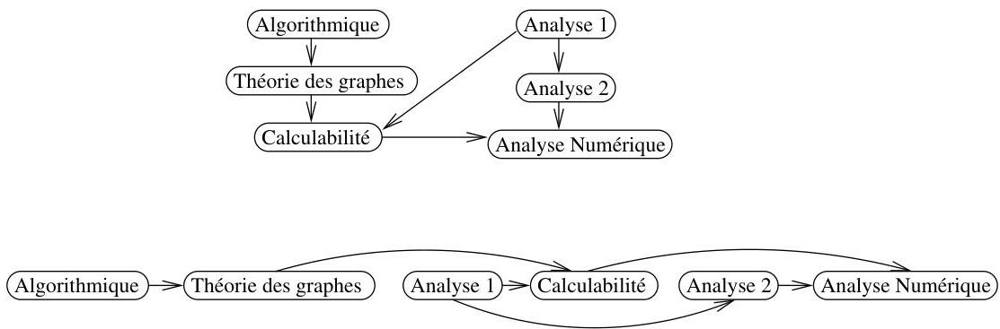
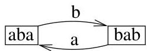

Chapitre I. Premier contact avec les graphes

correspondant. La question sous-jacente est de déterminer une indexation des sommets d'un graphe orienté sans cycle de manière telle que s'il existe un arc de  $v_{i}$  à  $v_{j}$ , alors  $i &lt; j$ .

FIGURE I.25. Une application du tri topologique.

Example I.3.16 (Tournoi). On imagine un ensemble d'équipes ou de joueurs et une compétition où chaque joueur affronte tout autre joueur exactement une fois. Le seul résultat possible est la victoire ou la défait. On peut alors considérer un graphe dont les sommets sont les joueurs et un arc relié le joueur  $i$  au joueur  $j$  si  $i$  a battu  $j$  lors de leur confrontation directe. La question naturelle qui se pose est alors d'essayer de déterminer un vainqueur pour la compétition.

Example I.3.17 (Graphe de De Bruijn). En combinatoire des mots, on étudie entre autres, les mots infinis (i.e., les suites infinies  $w: \mathbb{N} \to \Sigma$  dont les éléments sont à valeurs dans un ensemble fini  $\Sigma$ ). Le graphe de De Bruijn d'ordre  $k$  du mot  $w$  a pour sommets les facteurs de longueur  $k$  de  $w$  (i.e., les mots finis de la forme  $w_i \cdots w_{i+k-1}$ ) et on dispose d'un arc de label  $\sigma \in \Sigma$  entre les sommets  $\tau x$  et  $x\sigma$  si et seulement si  $\tau x\sigma$  est un facteur de  $w$  de longueur  $k+1$ . La figure I.26 représenté le graphe de De Bruijn d'ordre 3 du mot périodique abababab... Ces graphes sont en relation directe avec

FIGURE I.26. Le graphe de De Bruijn d'ordre 3 de ababab...

certaines propriétés combinatoires des mots correspondants. Par exemple, un mot infini est ultimement périodique (i.e., il existe des mots finis  $u$  et  $v$  tels que  $w = uvv \cdots$ ) si et seulement si, pour tout  $k$  suffisamment grand, son graphe de De Bruijn d'ordre  $k$  contient un unique cycle dont tous les sommets ont un demi-degré sortant égal à 1.

Example I.3.18 (Flot). Une société hydro-électrique dispose d'un ensemble de canalisations interconnectées de divers diamètres et désiré acheminer