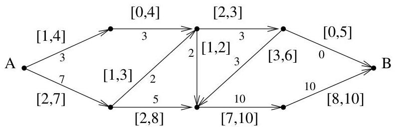

I.3. Quelques exemples

une quantité d'eau maximale d'un point  $A$  à un point  $B$ . Quelle quantité d'eau peut effectivement être acheminée et comment l'eau est-elle distribuée le long du réseau de canalisations? On peut imaginer que des contraintes techniques imposent en outre que chaque canalisation ait un débit maximum et minimum. Un tel exemple est représenté à la figure I.27 (les bornes de chaque canalisation sont représentées par un intervalle, une solution optimale est représentée par un nombre associé à chaque arc). On peut également

FIGURE I.27. Un problème de flot maximum.

prendre en compte une version pondérée où les coûts d'entretien des canalisations pourraient varier. On voudrait alors disposer d'un flot maximum pour un coût minimum.

Exemple I.3.19 (Chemin critique). Un entrepreneur charge de construire une maison doit planifier l'accomplissement de plusieurs tâches :

A: Creusage des fondations
B: Construction du gros-oeuvre
C: Installation électrique
D: Installation du chauffage central
E: Réalisation des peintures extérieures
F: Réalisation des peintures interieures

Ces diverses opérations sont soumises à des contraintes temporelles. Certaines tâches ne peuvent débuter avant que d'autres ne soient achevées; par contre, certaines peuvent aussi être réalisées en parallèle. Par exemple, les fondations doivent être creusées avant de débuter le gros oeuvre. De même, l'installation électrique doit être achevée avant de débuter les peintures interieures. Par contre, on peut effectuer simultanément les peintures extérieures et l'installation du chauffage. On considère un graphe dont les sommets correspondent à des instants marquant la fin de certaines étapes et le début d'autres. Les arcs sont pondérés par le temps nécessaire à la réalisation d'une tâche. On obtient pour notre exemple, le graphe représenté à la figure I.28 où 0 représentée le début des travaux, 1 le début du gros-oeuvre, 2 le début de l'installation électrique, 3 celui du chauffage, 4 celui de la peinture extérieure, 5 celui de la peinture interieure et enfin, 6 représentée la fin des travaux. Sur notre exemple, on voit des pondérations différentes au sortir du sommet 1. Cela peut par exemple signifier que la tâche 2 peut débuter sans que le gros-oeuvre ne soit totalement achevé (par contre, pour