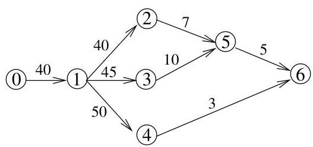

Chapitre I. Premier contact avec les graphes

FIGURE I.28. Chemin critique dans la planification de tâches.

débuter 4, le gros oeuvre doit être entièrement terminé, ce qui explique une pondération plus importante). Se dégage alors la notion de chemin critique, chemin de poids maximal entre le début et la fin des travaux. En effet, pour achever la maison, toutes les tâches auront été entièrement exécutées et par conséquent, il faudra également emprunter le chemin correspondant à la réalisation des tâches les plus lentes. Ce chemin critique permet donc de déterminer le temps minimum nécessaire à l'achèvement des travaux.

# 4. Chemins et circuits

Les définitions suivantes sont somme toute assez naturelles et intuitives, mais il faut bien les préciser au moins une fois de manière rigoureuse pour savoir de quoi on parle exactement.

Definition I.4.1. Soit  $G = (V, E)$  un multi-graphe non orienté. Un chemin de longueur  $k \geq 1$  est une suite ordonnée  $(e_1, \ldots, e_k)$  de  $k$  arêtes adjacentes  $e_i = \{e_{i,1}, e_{i,2}\}$ , i.e., pour tous  $i \in \{1, \ldots, k-1\}$ ,  $e_{i,2} = e_{i+1,1}$ . Ce chemin de longueur  $k$  joint les sommets  $e_{1,1}$  et  $e_{k,2}$ . On dit que le chemin  $(e_1, \ldots, e_k)$  passes par les arêtes  $e_1, \ldots, e_k$  (resp. par les sommets  $e_{1,1}, e_{2,1}, \ldots, e_{k,1}$  et  $e_{k,2}$ ). On supposera qu'un chemin de longueur 0 (correspondant à la suite vide) joint toujours un sommet à lui-même.

Si les extrémités du chemin sont égales, i.e., si  $e_{1,1} = e_{k,2}$ , on parle只不过 de cycle, de circuit ou encore de chemin fermé. Si on désire préciser que le chemin considéré n'est pas un cycle, on parlera de chemin ouvert.

Il se peut que les arêtes d'un chemin soient toutes distinctes (cela n'implique pas que les sommets du chemin soient tous distincts). On parle alors de piste ou de chemin élémentaire (voir par exemple, la figure I.29).

Si les arêtes d'un chemin sont toutes distinctes et si de plus, les sommets sont tous distincts $^{10}$ , on parle alors de chemin simple.

Bien sur, les circuits étant des chemins particuliers, on parle aussi de circuit élémentaire ou simple (voir par exemple, la figure I.30). Evidemment, dans la définition d'un circuit simple, on admet que les sommets  $e_{1,1}$  de départ et  $e_{k,2}$  d'arrivée puissant être égaux, mais seulement eux. Il est clair