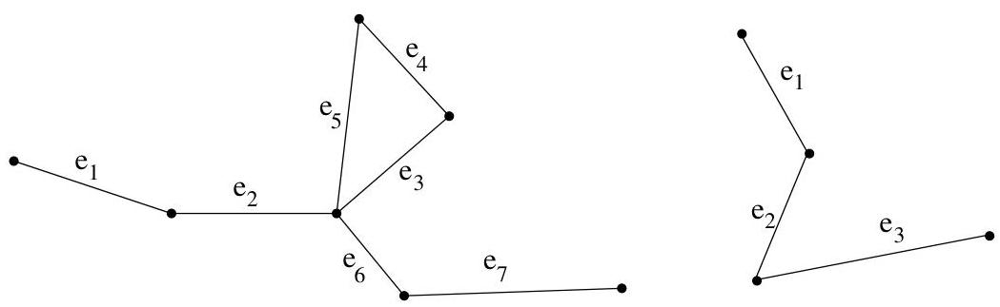
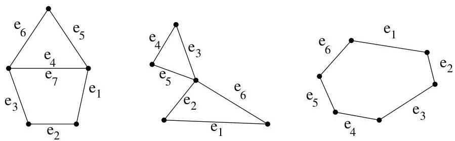

I.4. Chemins et circuits

FIGURE I.29. Une piste (ou chemin élémentaire) et un chemin simple

FIGURE I.30. Un circuit, un circuit élémentaire (ou piste fermée) et un circuit simple.

que tout circuit peut se décomposer en circuits simples.

Remarque I.4.2. Suivant les auteurs, la terminologie peut changer enormément. Ainsi, il n'est pas rare (par exemple, pour C. Berge), d'inverser les définitions des adjectifs simple et élémentaire. Pour d'autres, la notion de cycle contient de plus le caractère élémentaire, voire simple.

Remarque I.4.3. Dans le cas d'un graphe (qui n'est pas un multi-graphe), c'est-à-dire pour un 1-graphe, un chemin est aussi univoquement déterminé par une suite de sommets  $(v_{1},\ldots ,v_{k})$  de manière telle que  $\{v_{i},v_{i + 1}\}$  est une arête du graphe.

Définition I.4.4. Deux sommets  $a$  et  $b$  sont connectés s'il existe un chemin les joignant, ce que l'on notera  $a \sim b$ . La relation  $\sim$  "être connecté" est une relation d'équivalence sur  $V$ . Une classe d'équivalence pour  $\sim$  est une composante connexe de  $G$ . Un multi-graphe non orienté est connexe si  $V / \sim$  contient une seule classe d'équivalence, i.e.,  $G$  possède une seule composante connexe. Autrement dit, un multi-graphe non orienté est connexe si, pour toute paire de sommets, il existe un chemin les joignant. On supposera de plus que  $G = (\{v\}, \emptyset)$  est connexe (ce qui revient à supposer qu'un chemin de longueur 0 joint toujours un sommet à lui-même).