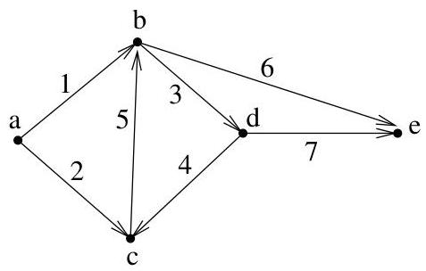

I.4. Chemins et circuits

Exemple I.4.8. Considerons le multi-graphe orienté de la figure I.31 dont l'ensemble des sommets est  $\{a, \ldots, e\}$  et l'ensemble des arcs est  $\{1, \ldots, 7\}$ . Ce graphe est simplement connexe mais il n'est pas fortement connexe. En

FIGURE I.31. Un graphe orienté.

effet, il n'existe pas de chemin joignant les sommets  $d$  à  $a$ . L'ensemble  $\{b, c, d\}$  est une composante fortement connexe du graphe (les deux autres composantes sont  $\{a\}$  et  $\{e\}$ ). Un chemin est par exemple donné par  $(1, 3, 7)$ , un cycle par  $(3, 4, 5)$  et une piste par  $(1, 3, 4, 5, 6)$ . La distance entre  $d$  et  $c$  vaut 1. Par contre, la distance entre  $c$  et  $d$  vaut 2.

4.1. Recherche du plus court chemin. Soit  $G = (V, E)$  un digraphe pondéré par la fonction  $p: E \to \mathbb{R}^+$ . Nous allonsprésenter l'algorithmme de Dijkstra de recherche d'un plus court chemin (i.e., un chemin de poids minimal) d'un sommet  $u$  fixé à un sommet quelconque de  $G$ . Il est clair que l'on peut restreindre ce problème au cas d'un digraphe simple $^{15}$ . Pour rappel, si  $u$  et  $v$  sont deux sommets tels que  $u \to v$ , le poids d'un chemin  $(e_1, \ldots, e_k)$  les joignant est  $\sum_{i} p(e_i)$ . La distance de  $u$  à  $v$  est alors le poids minimal de tels chemins. Si  $u \nrightarrow v$ , on n'a pas à proprement parler de distance $^{16}$  et par convention, on posera que la "distance" de  $u$  à  $v$  est alors  $+\infty$ .

L'algorithm de Dijkstra s'applique également à un graphe non orienté. Il suffit de replacer l'arête  $\{u, v\}$  de poids  $\alpha$  par deux arcs  $(u, v)$  et  $(v, u)$  ayant chacun un poids  $\alpha$  et ainsi obtenir un digraphe.

Remarque I.4.9. Quitte à supposer  $p$  à valeurs dans  $\mathbb{R}^+ \cup \{+\infty\}$ , on étend  $p$  de  $E$  à  $V \times V$  tout entier en posant  $p(x, x) = 0$ , pour tout  $x \in V$  et  $p(x, y) = +\infty$ , si  $(x, y) \notin E$ . C'est ce que nous supposerons par la suite.

Intuitivement, l'algorithmie fonctionne de la manière suivante. A chaque sommet  $v$  de  $G$ , on associe une valeur  $\mathbb{T}(v)$ , initialisée à  $p(u,v)$  et une liste de sommets  $\mathbb{C}(v)$  censée correspondre à un chemin de  $u$  à  $v$ . Lorsque