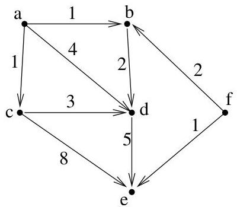

Chapitre I. Premier contact avec les graphes

l'algorithmme s'achève,  $\mathsf{T}(v)$  contient le poids minimal des chemins joignant  $u$  à  $v$  et  $\mathsf{C}(v)$  réalise un tel chemin (ou alors,  $\mathsf{T}(v) = +\infty$  si  $u \nrightarrow v$ ). L'idée est de construire de proche en proche un ensemble  $X \subseteq V$  de manière telle qu'un chemin de poids minimal de  $u$  à  $v \in X$  passes uniquement par des sommets de  $X$ . L'ensemble  $X$  est initialisé à  $\{u\}$  et à chaque étape, on ajoute un sommet à l'ensemble.

Algorithm I.4.10 (Algorithmé de Dijkstra). Les données sont un digraphé simple  $G = (V, E)$  pondéré par une fonction  $p: V \times V \to \mathbb{R}^+ \cup \{+\infty\}$  (cf. remarque I.4.9) et un sommet  $u$ .

```latex
Pour tout sommet  $v\in V$  ，T(v):=p(u,v)，C(v):=(u,v)
$\mathbf{X}:=\{u\}$
Tant que  $\mathbf{X}\neq V$  ，répéter
Choisir  $v\in V\backslash \mathbf{X}$  tel que, pour tout  $y\in V\backslash \mathbf{X}$  ，T(v)≤T(y)17
$\mathbf{X}:=\mathbf{X}\cup\{v\}$
Pour tout  $y\in V\backslash \mathbf{X}$
Si  $\mathrm{T}(y) &gt; \mathrm{T}(v) + p(v,y)$  ，alors  $\mathrm{T}(y):=\mathrm{T}(v)+p(v,y)$  et  $\mathrm{C}(y):=[\mathrm{C}(v),y]$
```

Dans cet algorithme, la notation  $[\mathbb{C}(v),y]$  représentée la liste  $\mathbb{C}(v)$  à laquelle on ajoute un élément  $y$ . Intuitivement, lorsqu'on ajoute un sommet  $\mathbf{v}$  à  $\mathbf{X}$ , on regarde s'il est avantageux pour les sommets  $\mathbf{y}$  ne se trouvant pas dans  $\mathbf{X}$  de passer par ce sommet  $\mathbf{v}$  nouvellement ajouté à  $\mathbf{X}$ . Si tel est le cas, on met à jour les informations concernant  $\mathbf{y}$ .

Avant de démontré l'exactitude de cet algorithme, donnons un exemple d'application de ce dernier.

Example I.4.11. Voici une application de l'algorithm de Dijkstra au graphe représenté à la figure I.32. Pour l'initialisation, prenons  $\mathbf{X} = \{a\}$


FIGURE I.32. Un digraphesimplepondéré.

et on a

|  v | a | b | c | d | e | f  |
| --- | --- | --- | --- | --- | --- | --- |
|  T(v) | 0 | 1 | 1 | 4 | +∞ | +∞  |
|  C(v) | (a,a) | (a,b) | (a,c) | (a,d) | (a,e) | (a,f)  |