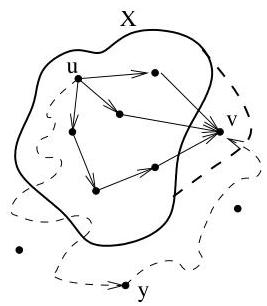
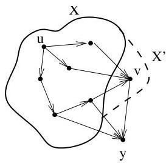

Chapitre I. Premier contact avec les graphes

FIGURE I.33. Illustration de l'algorithm de Dijkstra.

Pour la seconde assertion, on procède de manière analogue en utilisant cette fois la dernière ligne de l'algorithmie pour obtenir une contradiction. Plus précisé, passons d'un ensemble  $X$  à  $n$  sommets à un ensemble  $X'$  à  $n + 1$  sommets en lui ajoutant un sommet  $v$ . Supposons à présent que ii) n'est plus satisfait et qu'il existe donc un sommet  $y \notin X'$  tel que  $\mathbb{T}(y)$  est strictement supérieur au poids minimal des chemins joignant  $u$  à  $y$  qui, à l'exception de  $y$ , passent uniquement par des sommets de  $X'$ . Or, par hypothèse de récurrence, nous savons que l'assertion ii) était satisfaite pour  $\# X = n$ . Autrement dit, avant d'ajouter le sommet  $v$ ,  $\mathbb{T}(y)$  était minimal

FIGURE I.34. Illustration de l'algorithm de Dijkstra.

pour les chemins joignant  $u$  à  $y$  qui, à l'exception de  $y$ , passent uniquement par des sommets de  $X$ . Ainsi, en ajoutant le sommet  $v$  à  $X$ , on aurait replacé  $\mathbb{T}(y)$  par une valeur supérieure, ce qui est en contradiction avec les prescriptions de l'algorithmie (à la dernière ligne, on spécifique de replacer  $\mathbb{T}(y)$  uniquement lorsqu'il est préféable de passer par  $v$ ).

Remarque I.4.12. On peut facilement voir que l'algorithmie de Dijkstra a une complexité temporelle en  $\mathcal{O}((\# V)^2)$ . Avec une implémentation minutieuse, utilisant les listes d'adjacence et les files de priorité, on obtient même une complexité en  $\mathcal{O}((\# E + \# V) \log \# V)$ .

Remarque I.4.13. [16] Le routage des données entre les réseaux d'un internet est l'une des applications où les plus courts chemins jouent un role important. Le routage est le processus consistant à prendre des décisions sur la façon de déplacer