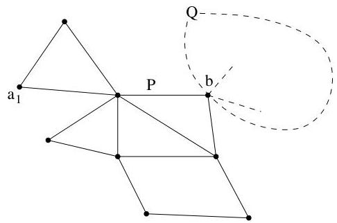

Chapitre I. Premier contact avec les graphes

Théorème I.4.16. Un multi-graphe fini non orienté connexe  $G = (V, E)$  possède un circuit eulérien si et seulement si le degré de chaque sommet est pair.

Démonstration. Supposons donc que chaque sommet de  $G$  est de degré pair. Débutons la construction d'une piste avec un sommet  $a_1$  de  $G$ . A chaque étape  $i \geq 1$  de cette construction, on désit un sommet  $a_{i+1}$  de manière telle qu'une arête  $\{a_i, a_{i+1}\} \in E$  est sélectionnée parmi les  $\# E - i + 1$  arêtes non déjà sélectionnées. Puisque chaque sommet est de degré pair, cette sélection est toujours possible ("lorsqu'on aboutit dans un sommet, on peut toujours en repartir"). Puisque le graphe est fini, cette procédure s'achève toujours.

On dispose alors d'une piste  $P$  joignant  $a_1$  à un certain sommet  $a_\ell$ . En fait, on peut supposer que cette piste est fermée, i.e.,  $a_\ell = a_1$ . En effet, si  $a_\ell$  diffère de  $a_1$ , puisque le degré de chaque sommet est pair, on peut étendre la piste en ajoutant une arête  $\{a_\ell, a_{\ell+1}\}$ . En continuant de la sorte $^{19}$ , on épuise les sommets jusqu'à revenir en  $a_1$ .

Si la piste fermée  $P$  est un circuit eulérien, le théorème est démontré. Sinon, il existe un sommet  $b$  de  $P$  qui est l'extrémité d'un nombre pair d'arêtes n'apparaissant pas dans  $P$ . (Une illustration est donnée à la figure I.35. Depuis  $b$ , il est possible de construire une piste fermée  $Q$  formée

FIGURE I.35. Construction d'un circuit eulérien.

uniquement d'arêtes n'apparaissant pas dans  $P$ . (On utilise la même procédure que précédemment; il est clair que le degré de chaque sommet est encore pair.) De cette façon, nous avons étendu la piste  $P$  en une piste plus longue  $P \cup Q$  (couvrant un plus grand nombre d'arêtes). On obtient alors un circuit eulérien en répétant cette étape un nombre fini de fois.

Corollaire I.4.17. Le problème des sept points de Königsberg donné dans l'exemple I.3.1 n'admet pas de solution.