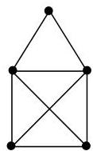

I.4. Chemins et circuits

Démonstration. C'est immédiat, le graphe de la figure I.12 possède un sommet de degré 5 et 3 sommets de degré 3.

Corollaire I.4.18. Un multi-graphe non orienté connexe possède un chemin eulérien joignant deux sommets  $a$  et  $b$  si et seulement si  $a$  et  $b$  sont les deux seuls sommets de degré impair.

Démonstration. Pour se ramener au théorème précédent, il suffit de considérer le graphe  $G$  auquel on ajoute une arête supplémentaire joignant les sommets  $a$  et  $b$ .

Exemple I.4.19. Fort des résultats precedents, on peut par exemple répondre à la question: "le dessin suivant peut-il ou non être trace d'un seul trait, sans lever le crayon et sans repasser deux fois par un trait déjà trace ?". C'est une simple application du corollaire précédent $^{20}$ .


FIGURE I.36. Une maison à tracer d'un seul trait.

Nous présentons succinctement l'algorithmme de Fleury permettant de construire un circuit eulérien (à supposer qu'un tel circuit existe). Cet algorithme repose sur la notion d'arête de coupure représentée à la section 6. Nous conseillons donc au lecteur de passer cet algorithme en première lecture.

Algorithme I.4.20 (Fleury). La donnée fournie à cet algorithme est un graphe simple eulérien.

```txt
Choisir un sommet  $v_{0}\in V$ $i\coloneqq 1$
Répéter tant que possible
Choisir une arête  $e_i = \{v_{i - 1},v_i\} \in V$  telle que  $\triangleright e_i$  diffère des arêtes déjà choisis  $e_1,\ldots ,e_{i - 1}$  autant que possible,  $e_i$  ne doit pas être une arête de coupure de  $G_{i} = G - \{e_{1},\dots ,e_{i - 1}\}$ $i\coloneqq i + 1$
```

Cet algorithme fournit une suite d'arêtes  $e_1, e_2, \ldots$  qui constituent un circuit eulérien.