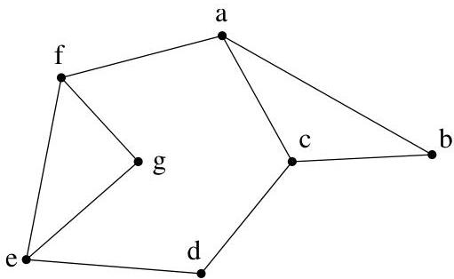

I.4. Chemins et circuits

nouvellement déterminés comme appartenant à la composante connexe. Il s'agit donc de deux variables de type ensembliste. Lorsqu'il n'y a plus de nouveaux sommets à ajouter à la liste des sommets appartenant à la composante connexe, l'algorithmme s'achève. Il reste alors à déterminer si cette composante connexe contient ou non tous les sommets de  $G$ . En particulier, à la fin de cet algorithme, la variable Composante est égale à la composante connexe de  $v_{0}$ .

L'emploi de cet algorithme est facilité par la construction préalable d'un dictionnaire des voisins. Il s'agit d'une liste associant à chaque sommet  $v$ , l'ensemble  $\nu(v)$  de ses voisins.

Example I.4.24. Considérons le graphe simple représenté à la figure I.37 et appliquons-lui l'algorithmme I.4.23. Les résultats de l'algorithmme se trouvent dans le tableau I.2. Le tableau I.1 donne le dictionnaire des voisins

FIGURE I.37. Un graphe simple (connexe).

construit une fois pour toutes. Le tableau I.2 montre l'évolution des vari-

|  v | ν(v)  |
| --- | --- |
|  a | {b, c, f}  |
|  b | {a, c}  |
|  c | {a, b, d}  |
|  d | {c, e}  |
|  e | {d, f, g}  |
|  f | {a, e, g}  |
|  g | {e, f}  |

TABLE I.1. Dictionnaire des voisins.

ables apparaissant dans l'algorithmme avec comme choix initial,  $v_{0} = c$ .

4.4. Décomposition en composantes fortement connexes. La détermination de la composante fortement connexe contenant un sommet donné  $v_{0}$  s'inspire de l'algorithmme I.4.23. Il est clair que, pour ce problème, il suffit de considérer le cas de graphes orientés simples. Déterminer si un graphe est connexe, autrement dit s'il possède une seule composante connexe, est l'une des deux étapes permettant de decide si un graphe donné possède