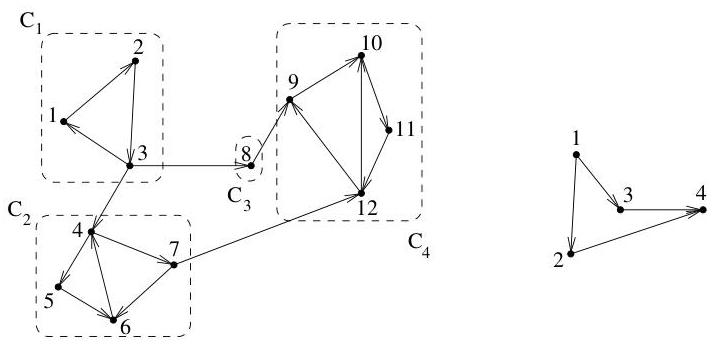

I.4. Chemins et circuits

Ainsi,

$$
a \leftrightarrow b \Leftrightarrow b \in \operatorname {s u c c} ^ {*} (a) \cap \operatorname {p r e d} ^ {*} (a).
$$

L'algorithmme I.4.23 peut facilement être adapté pour calculer  $\mathrm{succ}^* (a)$  (resp.  $\mathrm{pred}^* (a)$ ). Il suffit principalement d'initialiser les variables Composante et New à  $\{a\}$  et de replacer  $\nu (v)$  par  $\mathrm{succ}(v)$  (resp.  $\mathrm{pred}(v)$ ). En recherchant ainsi l'intersection des deux ensembles, on détermine la composante f. connexe du sommet  $a$ . Si cette composante est égale à l'ensemble des sommets, alors le graphe est f. connexe.

Definition I.4.27. Soit  $G = (V, E)$  a graphe orienté. On construit un nouveau graphe orienté, appelé graphe acyclique des composantes $^{21}$  ou encore condensé de  $G$ , dont les sommets sont les composantes f. connexes de  $G$ . Un arc joint deux composantes f. connexes  $A$  et  $B$ , s'il existe  $a \in A$  et  $b \in B$  tels que  $a \to b$ .

Remarque I.4.28. Bien évidemment, s'il existe  $a \in A$  et  $b \in B$  tels que  $a \to b$ , alors il n'existe aucun  $a' \in A$  ni aucun  $b' \in B$  tels que  $b' \to a'$ . En effet, si tel était le cas,  $A \cup B$  serait alors une composante f. connexe de  $G$ . Ceci est impossible vu la maximalité des composantes connexes. D'une manière générale, le graphe des composantes ne contient pas de cycle.

Example I.4.29. La figure I.38 représenté un digraphé et ses composantes f. connexes ainsi que le graphe des composantes correspondant.

FIGURE I.38. digraphé et graphe des composantes.

Le résultat suivant donne un lien entre la simple connexité et la forte connexité.

Lemma I.4.30. Soit  $G$  un digraph (simple) tel que pour tout  $v \in V$ ,  $d^{+}(v) = d^{-}(v)$ . Alors,  $G$  est f. connexe si et seulement si il est s. connexe.

Démonstration. Il est clair que la f. connexité implique la s. connexité. Supposons que  $G$  est s. connexe, que pour tout  $v$ ,  $d^{+}(v) = d^{-}(v)$ , mais que  $G$  n'est pas f. connexe. Notre but est d'obtenir une contradiction. Soient  $C_1, \ldots, C_r$  les composantes f. connexes de  $G$  (ou  $r \geq 2$ ). Comme nous