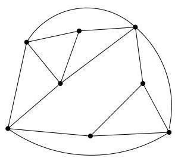
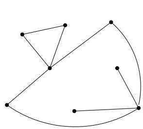
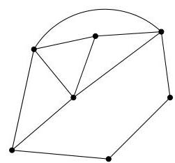

I.5. Sous-graphes

# 5. Sous-graphes

Dans la preuve du lemme I.4.30, nous avons considéré la restriction d'un graphe à une de ses composantes. Dans cette section, nous formalisons ce type de construction. Grosso modo, un sous-graphe d'un graphe donné est un graphe obtenu en supprimant certains sommets et/ou arêtes.

Definition I.5.1. Soient  $G = (V, E)$  et  $G' = (V', E')$  deux graphes (orientés ou non). Le graphe  $G'$  est un sous-graphe de  $G$  si

$V^{\prime}\subseteq V$
$E^{\prime}\subseteq E\cap (V^{\prime}\times V^{\prime}).$

Ainsi,  $G'$  est un sous-graphe de  $G$  s'il est obtenu en enlevant à  $G$  certains sommets et/ou certains arcs ou arêtes. En particulier, si on enlève un sommet  $v$  de  $G$ , il faut nécessairement enlever tous les arcs (ou arêtes) incidents à  $v$ . Par contre, pour construire  $G'$ , on peut très bien enlever un arc (ou une arête) de  $G$  sans pour autant enlever le moindre sommet de  $G$ . Le graphe  $G'$  est un sous-graphe propre de  $G$  si  $E' \subsetneq E$  ou  $V' \subsetneq V$ . Dans le premier

FIGURE I.39. Un graphe et deux sous-graphes.

sous-graphe de la figure I.39, on a enlevé uniquement certaines arêtes. Dans le second, on a enlevé un sommet et les arêtes adjacentes.

Soient  $v \in V$  et  $e \in E$ . On note  $G - e$  (resp.  $G - v$ ) le sous-graphe  $G'$  de  $G$  obtenu en supprimant l'arc (ou l'arête)  $e$  (resp. le sous-graphe  $G'$  obtenu en supprimant le sommet  $v$  et les arcs (ou les arêtes) adjacents). Par analogie, on notera  $G = G' + e$  (resp.  $G = G' + v$ ), le graphe obtenu par adjonction à  $G'$  d'une arête ou d'un sommet.

On peut bien évidemment étendre ces notations à un ensemble fini de sommets. Ainsi, si  $W = \{v_{1},\ldots ,v_{k}\} \subseteq V$ , alors  $G - W$  est le sous-graphe

$$
\left(\dots \left(\left(G - v _ {1}\right) - v _ {2}\right) \dots - v _ {k - 1}\right) - v _ {k} := G - v _ {1} - \dots - v _ {k}.
$$

On procède de même pour un ensemble fini d'arcs (ou d'arêtes) et on introduit une notation  $G - F$  pour un sous-ensemble  $F$  de  $E$ .

Soit  $W \subseteq V$ . Le sous-graphe de  $G$  induit par  $W$  est le sous-graphe  $G' = (W, E')$  avec  $E' = E \cap (W \times W)$ .

Si  $W \subseteq V$  est tel que le sous-graphe induit par  $W$  ne contient aucune arête, alors les sommets de  $W$  sont dits indépendants. Le nombre maximal de sommets indépendants de  $G$  est noté  $\alpha(G)$ .