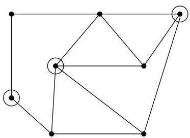

Chapitre I. Premier contact avec les graphes

FIGURE I.40. Des sommets indépendants.

Definition I.5.2. Soient  $G = (V, E)$  un graphe et  $G' = (V', E')$  un de ses sous-graphes. On dit que  $G'$  est un sous-graphe couvrant  $G$ , si  $V' = V$  et si

$$
\forall v \in V, \exists z \in V: \{z, v \} \in E ^ {\prime}.
$$

On dira que  $E'$  est une couverture (des sommets) de  $G$ . Autrement dit, tout sommet de  $G$  est une extrémité d'une arête de  $E'$ .

Comme nous le verrons bientôt, on s'intéressera en particulier aux sous-graphes couvrants qui sont des arbres. Dans ce cas, on parlera naturellement de sous-arbre couvrant.

Exemple I.5.3. Le premier sous-graphe de la figure I.39 est couvrant. Un exemple de sous-arbre couvrant a été donné à l'exemple I.3.8.

# 6. Coupes, points d'articulation,  $k$ -connexité

Certains sommets ou arêtes d'un graphe (ou d'une composante) connexe jouent un role particulier : les enlever rendrait le graphe non connexe. D'un point de vue pratique (par exemple, pour un réseau électrique ou de distribution d'eau, ou encore pour l'Internet), il s'agit de composants cruciaux du réseau. En effet, une panne localisée en un tel endroit priverait par exemple toute une région de ressources peut-être vitales.

Définition I.6.1. Soit  $H = (V, E)$  un multi-graphe $^{23}$  non orienté connexe (ou une composante connexe d'un multi-graphe non orienté). Le sommet  $v$  est un point d'articulation, si  $H - v$  n'est plus connexe, ou réduit à un point. D'une manière générale, on dit aussi que  $v$  est un point d'articulation d'un multi-graphe  $H$  si  $H - v$  contient plus de composantes connexes que  $H$  (ou est réduit à un point).

Si  $H$  est connexe et ne contient aucun point d'articulation, alors on dira que  $H$  est au moins 2-connexe.

Définition I.6.2. On peut étendre la notion de point d'articulation de la manière suivante. Un ensemble d'articulation est un ensemble  $W$  de sommets du multi-graphe connexe  $H = (V, E)$  qui est tel que  $H - W$  n'est plus