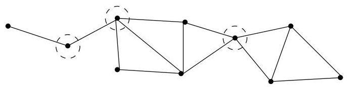
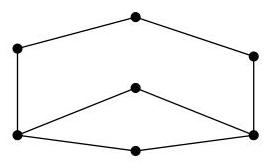
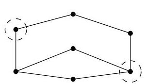
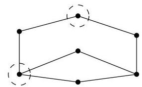

I.6. Coupes, points d'articulation,
k
-connexité

FIGURE I.41. Un graphe et ses points d'articulation.

FIGURE I.42. Un graphe au moins 2-connexe.

connexe (ou réduit à un sommet). D'une manière générale, pour un multi-graphe  $H$  quelconque, on dit aussi que  $W$  est un ensemble d'articulation si  $H - W$  contient plus de composantes connexes que  $H$ .

Definition I.6.3. Pour un graphe connexe  $H$ , on note  $\kappa(H)$  la taille minimale d'un ensemble d'articulation de  $H$ ,

$\kappa (H) = \min \{\# W\mid W\subseteq V:H - W$  disconnecté ou réduit à un sommet}.

En particulier, on a que  $\kappa(K_n) = n - 1$ . Pour un graphe  $G$  non connexe, on pose  $\kappa(G) = 0$ . Si  $\kappa(H) = k \geq 1$ , alors on dit que  $H$  est  $k$ -connexe. Ainsi, dans un graphe connexe  $G$ ,  $\kappa(G) = k$  signifie que quels que soient les  $k - 1$  sommets supprimés,  $G$  reste connexe mais il est possible de supprimer  $k$  sommets bien choisis pour disconnecter  $G$  (ou le rendre trivial). Pour un graphe  $G$  restreint à une unique arête, on a  $\kappa(G) = 1$  et pour le graphe vide, on pose  $\kappa(\emptyset) = 0$ .

Dans la définition I.6.1, lorsque nous avons parlé de graphe "au moins 2-connexe", cela signifie simplement que  $\kappa(G) \geq 2$ . Par exemple, le graphe de la figure I.42 qualifié d'au moins 2-connexe est en fait 2-connexe, comme on peut l'observer à la figure I.43; il suffit d'enlever deux sommets bien choisis pour le disconnector. D'une manière générale, on dira qu'un graphe

FIGURE I.43. Un graphe 2-connexe.

