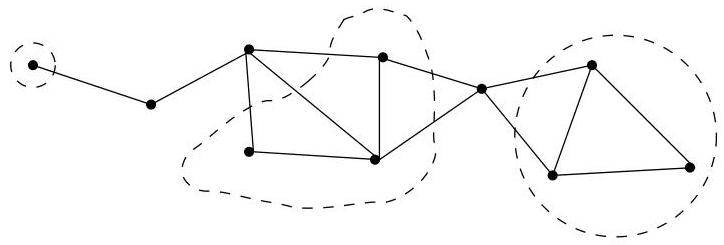
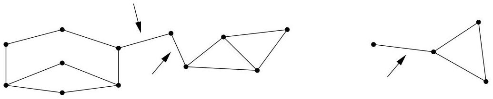

Chapitre I. Premier contact avec les graphes

$G$  est au moins  $k$ -connexe si  $\kappa(G) \geq k$ . En particulier, il est trivial $^{24}$  que si  $G$  est au moins  $(k + 1)$ -connexe, alors il est au moins  $k$ -connexe (i.e.,  $\kappa(G) \geq k + 1 \Rightarrow \kappa(G) \geq k$ ).

Remarque I.6.4. Si un graphe  $G = (V, E)$  contient au moins un point d'articulation, il est souvent commode de séparer  $G$  en ce qu'il est coutume d'appeler ses composantes 2-connexes. Il s'agit des composantes connexes obtenues après suppression des points d'articulation. Cette terminologie

FIGURE I.44. Un graphe et ses composantes 2-connexes.

consacrée n'est pas nécessairement la meilleure car, comme on peut le noter sur la figure I.44, une composante 2-connexe n'est pas nécessairement un graphe 2-connexe! En fait, les composantes 2-connexes permettent simplement demettre en évidence les zones du graphe robustes vis-à-vis de la connexité et de la suppression évientuelle d'un sommet.

Après s'être interressé aux sommets qui, lorsqu'on les supprime, disconnectent un graphe, nous considérons à présent les arêtes ayant une propriété analogue.

Definition I.6.5. Soit  $H = (V, E)$  un multi-graphe non orienté connexe (ou une composante connexe d'un multi-graphe non orienté). L'arête  $e$  est une arête de coupure si  $H - e$  n'est plus connexe. Au moins une extrémité d'une arête de coupure est bien évidemment un point d'articulation de  $H$ . Comme le montre le graphe de droite à la figure I.45, il y a des situations où seule une extrémité de l'arête de coupure est un point d'articulation.

FIGURE I.45. Un graphe et ses arêtes de coupure.