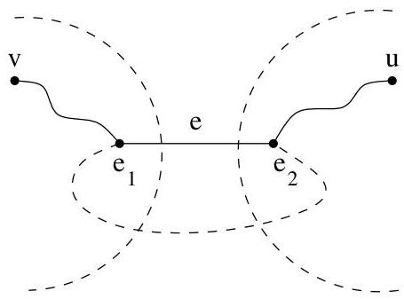

I.6. Coupes, points d'articulation,
k
-connexité

Le résultat suivant illustré le concept d'arête de coupure et permet aussi de répondre à la question de la mise à sens unique de routes évoqué dans l'exemple I.3.9.

Proposition I.6.6. Une arête  $e$  est une arête de coupure du graphe  $H = (V, E)$  si et seulement si  $e$  n'appartient à aucune piste fermée de  $H$ .

Démonstration. Si  $e$  est une arête de coupure, il existe des sommets  $u$  et  $v$  qui sont connectés dans  $H$  mais qui ne sont plus connectés dans  $H - e$ . Il existe donc un chemin joignant  $u$  et  $v$  qui passse par  $e$ . Dans  $H - e$ , une partie de ce chemin joint  $u$  à une extrémité de  $e$ , appelons-la  $e_1$  et l'autre partie du chemin joint  $v$  à l'autre extrémité de  $e$ , appelons-la  $e_2$ . Si  $e$  appartient à une piste fermée, il existe un chemin joignant  $e_1$  à  $e_2$  et ne passant pas par  $e$ . On peut donc en conclude que  $u$  et  $v$  sont encore connectés dans  $H - e$ , ce qui est impossible.

FIGURE I.46. Illustration de la proposition I.6.6

Passons à la réciproque et supposons que  $e = \{e_1, e_2\}$  n'est pas une arête de coupure. Si  $H$  est connexe,  $H - e$  l'est encore. Ainsi, il existe dans  $H - e$  une piste joignant  $e_1$  et  $e_2$ . De là, on conclut que dans  $H$ ,  $e$  appartient à une piste fermée.

Remarque I.6.7. Nous pouvons donner une solution au problème posé dans l'exemple I.3.9. En effet, si on dispose d'un graphe non orienté connexe et que l'on désire orienter ses arêtes de manière telle que le graphe résultat soit f. connexe, alors les arêtes de coupure doivent nécessairement être remplacées par deux arcs (pas de sens unique). Par contre, les autres arêtes appartiennent toutes à une piste fermée qu'il est aisé d'orienter (création de sens uniques).

Définition I.6.8. Soit  $H = (V, E)$  un multi-graphe non orienté connexe (ou une composante connexe d'un multi-graphe non orienté). L'ensemble  $F \subset E$  est un ensemble de coupure ou plus simplement une coupe ou coupure si  $F$  est un ensemble minimal (pour l'inclusion) tel que  $H - F$  n'est pas connexe. A la figure I.48, on a représenté en traits discontinus une des coupures du graphe.

coupe, coupure