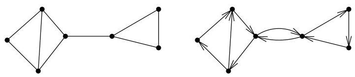
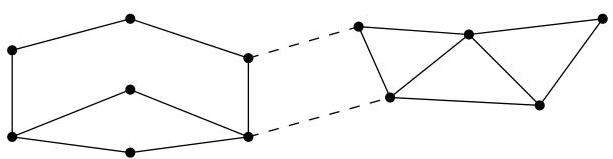
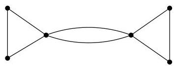

Chapitre I. Premier contact avec les graphes

FIGURE I.47. Mise à sens unique

FIGURE I.48. Un graphe et une coupure.

Definition I.6.9. La taille minimale d'une coupe de  $H$  se note  $\lambda(H)$ ,

$\lambda (H) = \min \{\# F\mid F\subseteq E:H - F$  disconnecté}.

Si  $H$  n'est pas connexe, on pose  $\lambda(H) = 0$ . Notons encore que dans la litterature, on rencontres souvent la notation  $\kappa'(H)$  plutôt que  $\lambda(H)$ . Si  $H$  est connexe et si  $\lambda(H) = k$ , on dit que  $H$  est  $k$ -connexe (pour les arêtes). Autrement dit, si on enlève  $k-1$  arêtes à un graphe  $k$ -connexe (pour les arêtes), il reste connexe; par contre, il est possible d'enlever  $k$  arêtes pour le disconnector. On veillera à ne pas confondre les notions de  $k$ -connexité et de  $k$ -connexité pour les arêtes.

Enfin, on dira qu'un graphe  $G$  est au moins  $k$ -connexe (pour les arêtes), si  $\lambda(G) \geq k$ .

Au vu de la définition ci-dessus, de la proposition I.6.6 et de la remarque I.6.7, on a immédiatement le résultat suivant.

Corollaire I.6.10 (Théorème de H.Robbins (1939)). On peut orienter un graphe connexe pour le rendre  $f$ . connexe si et seulement si ce graphe est au moins 2-connexe pour les arêtes.

Remarque I.6.11. Sur la figure I.49, le multi-graphe est 2-connexe pour les arêtes et pourtant, il suffit d'enlever un seul sommet pour le disconnector. Avec nos notations,  $\kappa(G) = 1$  et  $\lambda(G) = 2$ .

FIGURE I.49. Un multi-graphe tel que  $\lambda (G) = 2$  et  $\kappa (G) = 1$

De plus, les nombres  $\lambda(G)$  et  $\kappa(G)$  peuvent être très différents. En effet, pour le graphe de la figure I.50, on a  $\kappa(G) = 1$  et  $\lambda(G) = k$ .