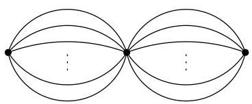
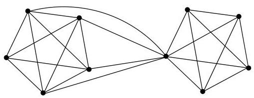

I.6. Coupes, points d'articulation,
k
-connexité

FIGURE I.50. Un multi-graphe tel que  $\lambda (G) = k$  et  $\kappa (G) = 1$

Mème dans le cas d'un graphe simple, il n'existe pas de lien direct entre  $\lambda(G)$  et  $\kappa(G)$ . On s'en convainc en considérant deux copies de  $K_{n}$  comme illustré à la figure I.51.

FIGURE I.51. Un graphe simple tel que  $\lambda(G) = 4$  et  $\kappa(G) = 1$ .

Enfin, il est clair que nous avons toujours

$$
\lambda (G) \leq \min  _ {v \in V} \deg (v).
$$

En effet, si  $v$  est un sommet de degré  $k$ , il suffit de supprimer les  $k$  arêtes incidentes à  $v$  pour isoler  $v$  des autres sommets du graphe. Signalons aussi un théorème de Whitney (1932),

$$
\kappa (G) \leq \lambda (G).
$$

Il semble évident que只不过 que de supprimer une arête, il suffirait d'en supprimer au plus une extrémité.

Remarque I.6.12. Si  $F$  est une coupure d'un graphe  $G$  connexe, alors, de par la minimalité de  $F$ ,  $G - F$  possède exactement deux composantes connexes et l'ensemble des sommets de  $G$  est donc partitionné en deux sous-ensembles correspondant à ces deux composantes.

Terminons cette section par une dernière définition.

Définition I.6.13. Une clique d'un graphe non orienté et simple  $G = (V, E)$  est un sous-graphe complet de  $G$ . La taille d'une clique est le nombre de sommets qui la composent. La taille maximale d'une clique de  $G$  est notée  $\omega(G)$ . Comme nous le verrons plus loin, les nombres  $\alpha(G)$  définis en page 37 et  $\omega(G)$  sont deux paramètres importants d'un graphe.