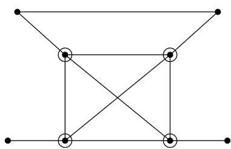

Chapitre I. Premier contact avec les graphes

FIGURE I.52. Une clique de taille 4,  $\omega (G) = 4$

# 7. Théorème(s) de Menger

Nous nous plaçons ici dans le cas de graphes simples non orientés. Comme le lecteur pourra s'en convaincre, il n'y a aucune différence à considérer le cas de multi-graphes. La notion définie ci-dessous est proche de la notion d'ensemble d'articulation.

Definition I.7.1. Soient un graphe  $G = (V, E)$  et  $u, v$  deux sommets distincts de  $G$ . Un sous-ensemble  $S \subseteq V \setminus \{u, v\}$  sépare  $u$  et  $v$  s'il n'existe aucun chemin joignant  $u$  et  $v$  dans le sous-graphe de  $G$  induit par  $V \setminus S$ .

Definition I.7.2. Deux chemins joignant  $u$  et  $v$  sont indépendants si les seuls sommets qu'ils ont en commun sont  $u$  et  $v$ .

Théorème I.7.3 (Menger (1927)). Soient  $u, v$  deux sommets non adjacents d'un graphe connexe  $G = (V, E)$ . La taille minimum d'un sous-ensemble de sommets séparant  $u$  et  $v$  est égale au nombre maximum de chemins deux à deux indépendants joignant  $u$  et  $v$ .

Démonstration. La preuve de ce résultat est assez longue. Dans ce cours introductif, nous ne faisons que l'esquisser sommairement. Si un sous-ensemble  $S \subset V$  sépare  $u$  et  $v$ , alors tout chemin joignant  $u$  et  $v$  passée nécessairement par un sommet de  $S$ . On en conclus que  $\# S$  majoré le nombre de chemins indépendants joignant  $u$  et  $v$ .

La seconde partie de la preuve consiste à montré par récurrence sur  $\# E + \# V$  que si un ensemble  $S \subset V$  de taille minimum sépare  $u$  et  $v$ , alors le nombre de chemins indépendants joignant  $u$  et  $v$  vaut au moins  $\# S$ .

Corollaire I.7.4 (Menger (1927)). Soit  $k \geq 2$ . Un graphe  $G = (V, E)$  est au moins  $k$ -connexe (pour les sommets) si et seulement si toute paire de sommets distincts de  $G$  est connectée par au moins  $k$  chemins indépendants.

Démonstration. Il est clair $^{25}$  que si toute paire de sommets est connectée par au moins  $k$  chemins indépendants, alors  $\kappa(G) \geq k$ .

La condition est nécessaire. Procedons par l'absurde. Supposons que  $\kappa(G) \geq k$  mais qu'il existe deux sommets  $u$  et  $v$  joints par au plus  $k - 1$