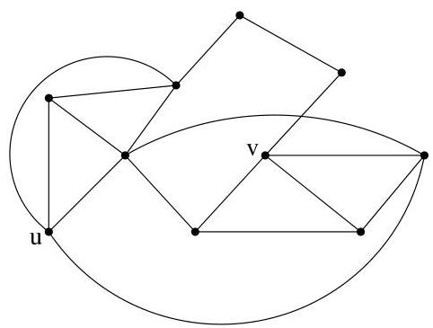
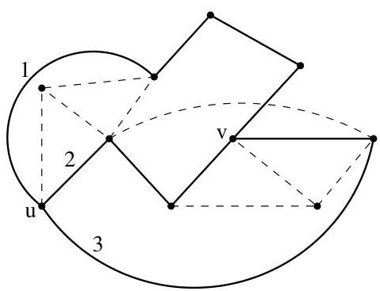
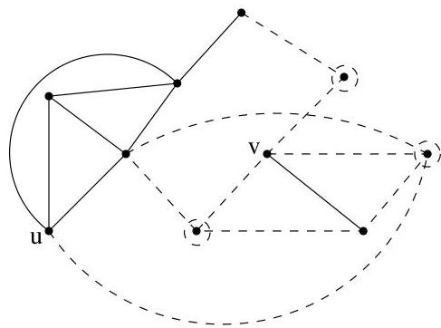

I.7. Théorème(s) de Menger

FIGURE I.53. Une illustration du théorème de Menger: 3 chemins indépendants joignent  $u$  et  $v$ , 3 sommets séparant  $u$  et  $v$ .

chemins indépendants. Au vu du théorème précédent, on en conclus que  $u$  et  $v$  sont adjacents, i.e., il existe une arête  $e = \{u,v\} \in E$ . Dans le graphe  $G - e$ ,  $u$  et  $v$  sont joints par au plus  $k - 2$  chemins indépendants. Puisque  $u$  et  $v$  ne sont pas adjacents dans  $G - e$ , on tire du théorème précédent qu'ils peuvent être séparés, dans  $G - e$ , par un ensemble  $S$  de taille minimale ne dépassant pas  $k - 2$  sommets, i.e.,  $\# S \leq k - 2$ .

Puisque  $\kappa(G) \geq k$ , cela implique en particulier que  $\# V &gt; k$ . Il existe donc un sommet  $w$  n'appartenant pas à  $S \cup \{u, v\}$ . Dans  $(G - e) - S$ , il ne peut y avoir simultanément deux chemins joignant  $w$  respectivement à  $u$  et à  $v$  car sinon on disposerait dans  $(G - e) - S$  de chemins joignant  $u$  à  $w$  et  $w$  à  $v$  et on pourrait en conclude que  $u$  et  $v$  ne sont pas séparés par  $S$ . Supposons dès lors qu'aucun chemin ne joint  $w$  et  $u$  dans  $(G - e) - S$ . L'ensemble  $S \cup \{v\}$  possède (au plus)  $k - 1$  éléments et sépare  $w$  et  $u$  dans  $G$ . Ceci contredit le fait que  $\kappa(G) \geq k$ .

Remarque I.7.5. Les résultats énoncés dans cette section concernent des propriétés de connexité relatives aux sommets d'un graphe. Il existe l'analogue de ces résultats en termes d'arêtes: Un graphe est au moins  $k$ -connexe