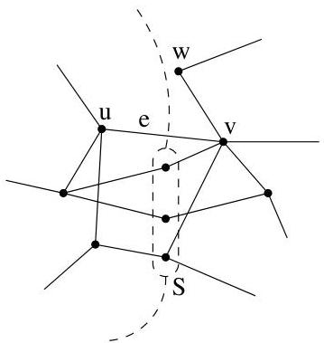

Chapitre I. Premier contact avec les graphes

FIGURE I.54. Une illustration de la preuve corollaire de Menger.

pour les arêtes si et seulement si toute paire de sommets est connectée par au moins  $k$  chemins ne partageant aucune arête.

# 8. Graphes orientés sans circuit et tri topologique

Dans cette courte section, on considère un graphe simple orienté et on désire tester algorithmiquement si celui-ci possède ou non un cycle. Comme nous le verrons bientôt, pouvoir répondre à cette question est une des étapes permettant de decide si un graphe donné possède une structure d'arbre. Lorsqu'on prend en compte cette question, il est inutile de considérer un graphe possédant des arcs multiples (cela ne change rien à l'existence d'un cycle) ou des boucles aux sommets. C'est pour cette raison que nous nous restreignons au cas de graphes simples. Comme application, nous allons, en fin de section, reconsiderer le problème général du tri topologique sommairementprésenté à l'exemple I.3.15.

Voici tout d'abord une condition nécessaire pour qu'un graphe soit sans circuit.

Lemma I.8.1. Si un graphe simple orienté  $G = (V, E)$  est sans cycle, alors il existe un sommet  $v$  tel que  $d^{-}(v) = 0$  (resp.  $d^{+}(v) = 0$ ).

Démonstration. Considérons un chemin simple  $(x_{1},\ldots ,x_{k})$  de  $G$  de longueur maximale déterminé par des sommets de  $G$  (autrement dit, ce chemin passé par des sommets distincts et il n'est pas possible d'avoir un chemin passant par plus de sommets). Si  $d^{-}(x_1) &gt; 0$ , alors il existe  $y\in \operatorname {pred}(x_1)$ . Si  $y$  était égal à un des  $x_{j}$ , on aurait alors un cycle  $(y,x_{1},\dots ,x_{j})$ , ce qui est impossible par hypothèse. Or par maximalité du chemin  $(x_{1},\ldots ,x_{k})$ , il n'est pas possible d'avoir un sommet distinct des  $x_{j}$  et tel que  $(y,x_{1})\in E$ .

On peut en déduire une condition nécessaire et suffisante pour qu'un graphe soit sans circuit.