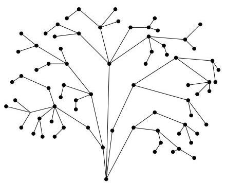

Chapitre I. Premier contact avec les graphes

FIGURE I.55. Un arbre.

On pourra en particulier observer que tout arbre est 1-connexe, la réciropque étant bien évidemment fausse.

Proposition I.9.3. Un graphe  $G = (V, E)$  simple connexe est un arbre si et seulement si chacune de ses arêtes est une arête de coupure.

Démonstration. Soient  $G$  un arbre et  $e$  une de ses arêtes. Puisque  $G$  est sans cycle, il ne possède aucune piste fermée. En appliquant la proposition I.6.6, on en déduit que  $e$  est une arête de coupure. Inversement, si  $G$  est un graphe connexe possédant une piste fermée alors, par la proposition I.6.6, les arêtes de cette piste ne peuvent être des arêtes de coupure.

Corollaire I.9.4. Tout graphe connexe possède un sous-arbre couvrant.

Démonstration. Soient  $G = (V, E)$  un graphe connexe et  $C = (V, E')$  un sous-graphe couvrant connexe minimal (i.e., on ne peut pas replacer  $E'$  par un sous-ensemble strict tout en conservant la connexité de  $C$ ). Vu la minimalité de  $C$ , chacune de ses arêtes est une arête de coupure de  $C$ . Par la proposition précédente, on en conclus que  $C$  est un arbre.

Corollaire I.9.5. Si  $G = (V, E)$  est un graphe (simple non orienté) connexe, alors  $\# E \geq \# V - 1$ .

Démonstration. Par le corollaire précédent,  $G$  possède un sous-arbre couvrant  $C = (V, E')$ . De là, il vient

$$
\# E \geq \# E ^ {\prime} = \# V - 1
$$

ou pour la dernière égalité, on a utilisé la proposition I.9.2.

Definition I.9.6. Un arbre  $A = (V, E)$  dans lequel on a privilégie un sommet  $v_0$  est appelé arbre pointé $^{27}$ . On le notera  $(A, v_0)$ . Le sommet  $v_0$  est parfois appelé la racine de l'arbre.