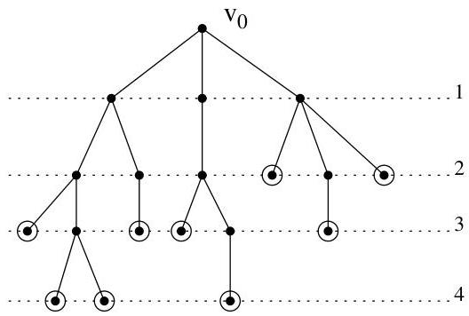

I.9. Arbres

Pour un arbre pointé  $(A, v_0)$ , les sommets de  $A$  peuvent être ordonnés suivant leur distance à  $v_0$ . Si  $v$  est un sommet tel que  $d(v_0, v) = i$ , on dira que  $v$  est un sommet de niveau  $i$ . Un arbre pointé a été représenté à la figure I.56.

FIGURE I.56. Un arbre pointé.

Si  $v$  est un sommet de niveau  $i$  et si tous ses voisins sont de niveau  $i - 1$ , on dit alors que  $v$  est une feuille de l'arbre. A la figure I.56, les feuilles ont été marquées d'un cercle. La hauteur d'un arbre est le niveau maximal de ses feuilles. L'arbre de la figure I.56 est un arbre de hauteur 4.

Remarque I.9.7. Pointer un arbre définit naturellement une orientation des arêtes de l'arbre. En effet, on peut orienter les arcs de façon à ce qu'ils joignent les sommets de niveau  $i$  aux sommets de niveau  $i + 1$ . Dans ce cadre, on parle souvent des fils (resp. du père) d'un noeud  $v$  pour désigner ses successeurs (resp. son unique prédécesseur). Les descendants (resp. ancêtres) de  $v$  désignent les éléments de  $\mathrm{succ}^* (v)$  (resp.  $\mathrm{pred}^* (v)$ ).

Definition I.9.8. Un arbre pointé est  $k$ -aire si tout sommet a au plus  $k$  fils. Si  $k = 2$ , on parle naturellement d'arbre binaire. Un arbre  $k$ -aire de hauteur  $n$  possède au plus

$$
1 + k + \dots + k ^ {n} = \frac {k ^ {n} - 1}{k - 1}
$$

sommets. S'il en possède exactement ce nombre, on parle d'arbre  $k$ -aire complet.

9.1. Parcours d'arbres. Un parcours d'un arbre est une façon d'en ordonner les noeuds. On supposera implicitement que les fils d'un noeud  $v_{i}$  sont ordonnés  $v_{i,1},\ldots ,v_{i,k_i}$  et que cet ordre est connu et fixé une fois pour toutes.

On désigne trois types de parcours en profondeur: les parcours préfixe, infixe et suffixe. Soit  $(A,v_0)$  un arbre pointé. Pour le parcours préfixe, on parcourt d'abord la racine puis on parcourt, de manière récursive et dans l'ordre, les sous-arbres pointés de racine respective  $v_{0,1},\ldots ,v_{0,k_0}$ . Pour le parcours suffixe, on parcourt d'abord, de manière récursive et dans l'ordre,