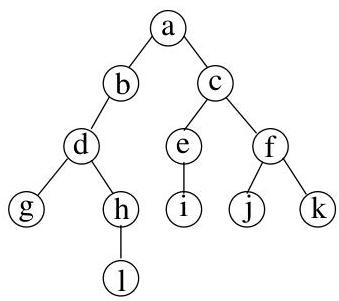

Chapitre I. Premier contact avec les graphes

les sous-arbres pointés de racine  $v_{0,1}, \ldots, v_{0,k_0}$ , puis la racine  $v_0$ . Pour le parcours infixe, nous supposerons disposer d'un arbre binaire. (On peut donc parler du sous-arbre de gauche et du sous-arbre de droite.) On parcourt d'abord, de manière récursive, le sous-arbre de gauche, puis la racine, et enfin le sous-arbre de droite $^{28}$ .

Exemple I.9.9. Considerons l'arbre binaire pointé donné à la figure I.57. Les fils d'un noeud sont ordonnés par l'ordre alphabétique de leur label. Si

FIGURE I.57. Un arbre à parcourir.

on parcourt cet arbre de manière préfixielle, on obtient la suite :

$a,b,d,g,h,l,c,e,i,f,j,k.$

Pour un parcours suffixe, on a

$g,l,h,d,b,i,e,j,k,f,c,a.$

Enfin, pour un parcours infixe, on obtient

$g,d,l,h,b,a,i,e,c,j,f,k.$

On rencontres parfois des parcours en largeur. Dans ce cas, on parcourt les noeuds de l'arbre pointé par niveau croissant. Sur l'exemple précédent, on a simplement l'ordre  $a, b, c, \ldots, k, l$ .

Remarque I.9.10. On peut également définir un parcours en profondeur d'un graphe quelconque. Bien qu'il ne s'agisse pas d'un problème concernant spécifique les arbres, nous pensons qu'il s'agit du moment opportun pour le définir. Soit  $G = (V,E)$  un graphe (orienté ou non) que l'on peut supposer simple et connexe. Un parcours en profondeur de  $G$  est défini récursivement comme suit. Sélectionner un sommet  $v_{0}$ . A l'étape  $k \geq 1$ , on désit un voisin de  $v_{k-1}$  qui n'a pas encore été sélectionné. Si un tel voisin n'existe pas, oncherche dans l'ordre, un voisin non sélectionné de  $v_{k-2}, \ldots, v_{0}$ .