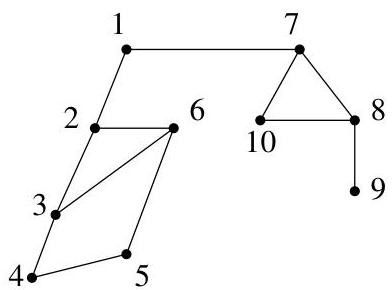
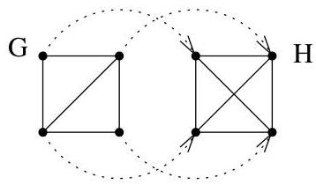
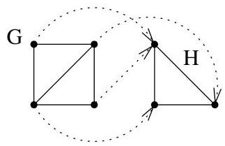

I.10. Isomorphismes de graphes

FIGURE I.58. Exemple de parcours en profondeur d'un graphe.

# 10. Isomorphismes de graphes

Definition I.10.1. Soient  $G_{i} = (V_{i},E_{i})$ ,  $i = 1,2$ , deux digraphes (resp. deux graphes non orientés). Une application  $f:V_{1}\to V_{2}$  est un homomorphism si

$$
(x, y) \in E _ {1} \Rightarrow (f (x), f (y)) \in E _ {2}
$$

$$
(\operatorname {r e s p .} \{x, y \} \in E _ {1} \Rightarrow \{f (x), f (y) \} \in E _ {2}).
$$

On parlera alors d'homomorphisme de  $G_{1}$  dans  $G_{2}$ . Il est clair que la composée d'homomorphismes est encore un homomorphisme.

Example I.10.2. Avec les graphes  $G$  et  $H$  de la figure I.59, on voit facilement qu'on a un homomorphisme de  $G$  dans  $H$  mais pas de  $H$  dans  $G$ . A la figure I.60, on donne un autre exemple d'homomorphisme entre deux

FIGURE I.59. Homomorphisme de  $G$  dans  $H$ .

graphes  $G$  et  $H$ . Cela montre que  $f: V_1 \to V_2$  n'est pas nécessairement injectif. Les homomorphismes de graphes réinterviendront dans les questions de coloriage.

FIGURE I.60. Homomorphisme de  $G$  dans  $H$ .