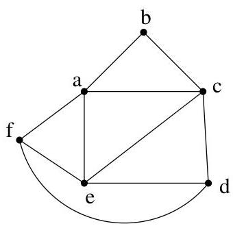
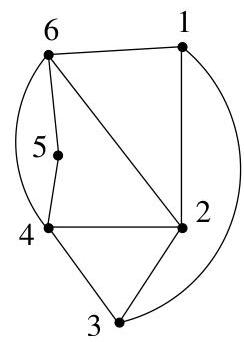

Chapitre I. Premier contact avec les graphes

Definition I.10.3. Deux digraphes (resp. deux graphes non orientés)  $G_{i} = (V_{i},E_{i})$ ,  $i = 1,2$ , sont isomorphes s'il existe une bijection  $f:V_{1}\to V_{2}$  qui est telle que

$$
(x, y) \in E _ {1} \Leftrightarrow (f (x), f (y)) \in E _ {2}
$$

(resp. telle que  $\{x,y\} \in E_1\Leftrightarrow \{f(x),f(y)\} \in E_2$ ). Cette définition s'adapte au cas de multi-graphes orientés. Deux multi-graphes  $G_{i} = (V_{i},E_{i})$ ,  $i = 1,2$ , sont isomorphes s'il existe une bijection  $f:V_{1}\to V_{2}$  telle que  $(x,y)$  est un arc de multiplicité  $k$  de  $G_{1}$  si et seulement si  $(f(x),f(y))$  est un arc de multiplicité  $k$  de  $G_{2}$ . Bien évidemment, une telle application  $f$  est qualifiée d'isomorphisme de graphes. Bien sur, si  $f$  est un isomorphisme, il en va de même pour  $f^{-1}$ .

Example I.10.4. Voici deux graphes isomorphes représentés à la figure I.61. On a un isomorphisme donné par

$$
\varphi : a \mapsto 4, b \mapsto 5, c \mapsto 6, d \mapsto 1, e \mapsto 2, f \mapsto 1.
$$

FIGURE I.61. Deux graphes isomorphes.

Definition I.10.5. Soit  $G = (V, E)$  un graphe (orienté ou non). Un automorphisme de  $G$  est un isomorphisme de  $G$  dans  $G$ . L'ensemble des automorphismes de  $G$  muni de la loi de composition d'applications forme un groupe, noté  $Aut(G)$ . Il s'agit bien évidemment d'un sous-groupe du groupe symétrique  $S_n$  des permutations de  $n = \# V$  éléments. Un graphe pour lequel  $Aut(G)$  est réduit à l'identité  $id_V$  est qualifié d'asymétrique.

Example I.10.6. Par exemple,  $Aut(K_n) = S_n$ .

La proposition suivante est immédiate et s'adapte aux autres cas de graphes.

Proposition I.10.7. Soient  $G$  un graphe (simple non orienté) et  $\varphi$  un automorphisme de  $G$ . Pour tous sommets  $u, v$ , on a

$\triangleright \deg (u) = \deg (\varphi (u))$
$\triangleright \mathrm{d}(u,v) = \mathrm{d}(\varphi (u),\varphi (v))$