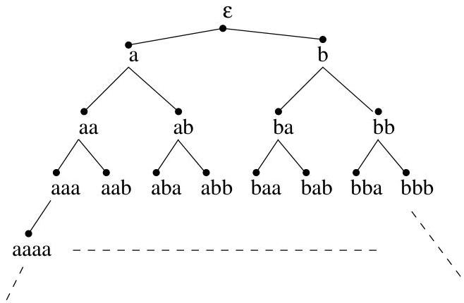

I.10. Isomorphisms de graphes

Remarque I.10.8. Si deux graphes  $G_{i} = (V_{i},E_{i})$ ,  $i = 1,2$  ont leurs sommets pondérés par  $p_i:V_i\to \Sigma$ , la définition d'un isomorphisme  $f:V_1\to V_2$  doit naturellement s'étendre en respectant de plus la propriété

$$
p _ {1} (v) = p _ {2} (f (v)), \forall v \in V _ {1}.
$$

Voici un exemple qui concerne des arbres infinis et qui met en lumière la notion d'isomorphisme dans le cas pondéré. Pour simplifier, supposons disposer de deux symboles (ou lettres) notés  $a$  et  $b$ . Avec ces lettres, on peut écrire des mots comme:  $aa$ ,  $bba$ ,  $b$  ou encore  $abbbaabaa$  (i.e., des suites finies de symboles). On construit un arbre binaire infini (i.e., on dispose d'une infinité de noeuds, chaque noeud ayant exactement deux fils) dont les noeuds sont en bijection avec les mots que l'on peut écrire avec les lettres  $a$  et  $b$ . Si un noeud est en bijection avec le mot  $m$ , son fils de gauche (resp. de droite) est en bijection avec  $ma$  (resp.  $mb$ ). La racine de l'arbre correspond au mot n'ayant aucune lettre, le mot vide  $\varepsilon$ . Nous dirons qu'un tel arbre est un arbre lexicographique. Ainsi, cet arbre possède exactement  $2^i$  noeuds de niveau  $i$  et ceux-ci correspondent de gauche à droite aux mots de longueur  $i: \frac{a \cdots aa}{i \times} \cdot a \cdots ab, \ldots, b \cdots ba, \frac{b \cdots bb}{i \times}$ . Une illustration est donnée à la figure I.62.

FIGURE I.62. Un arbre lexicographique infini.

Nous n'avons pas encore considéré de pondération des noeuds. Vu la bijection entre noeuds et mots, nous ne les distinguerons plus dans ce qui suit. Si on considère un ensemble  $L$  de mots écrit sur  $\{a,b\}$ , alors on définit la fonction  $p_L$  qui à un mot  $m$  associe 1 (resp. 0) si  $m \in L$  (resp.  $m \notin L$ ). Autrement dit, la pondération est simplement un codage définissant le dictionnaire des mots de  $L$ . Si on représentée par un rond noir les mots appartenant à  $L$  (i.e., tel que  $p_L(m) = 1$ ), on a, pour le langage formé des mots commençant par un nombre arbitraire de  $a$  (éventuellement aucun) et suivi par un nombre arbitraire de  $b$  (éventuellement aucun), l'arbre pondéré  $A_L$  repris à la figure I.63.