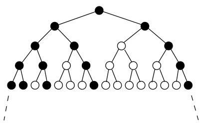
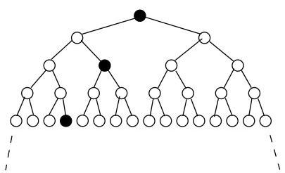

Chapitre I. Premier contact avec les graphes

FIGURE I.63. Un arbre infini pondéré représentant le dictionnaire de  $A_L$ .

Pour tout mot  $m$ , on peut définir l'arbre  $A_{m}$  comme le sous-arbre obtenu à partir de  $A_{L}$  en considérant comme nouvelle racine le noeud  $m$  et en ne conservant dans  $A_{m}$  que les descendants de  $m$  ( $m$  inclus). On peut se convaincre que l'arbre  $A_{L}$  ne possède, à isomorphisme près, que 3 sous-arbres non isomorphes (par exemple,  $A_{L}$  lui-même,  $A_{b}$  et  $A_{ba}$ ). Un arbre  $A_{L}$  ayant une telle propriété (nombre fini de sous-arbres non isomorphes $^{29}$ ) est qualifié de régulier.

Par exemple, tout ensemble fini de mots donne lieu à un arbre régulier et l'ensemble  $M$  des mots de la forme

$$
a ^ {i} b ^ {i} := \underbrace {a \cdots a} _ {i \times} \underbrace {b \cdots b} _ {i \times}, \quad \forall i \in \mathbb {N},
$$

donne quant à lui un arbre  $A_{M}$  non régulier (cf. figure I.64). En effet, les

FIGURE I.64. Un arbre infini pondéré représentant le dictionnaire de  $A_{M}$ .

arbres  $A_{\varepsilon}, A_{a}, A_{aa}, A_{aaa}, \ldots$  sont tous distincts (on remarque que, dans  $A_{a^i}$ , le premier niveau sur lequel on rencontres un noeud noirci est le  $i$ -ème).

# 11. Graphes hamiltoniens

Nous avons vu dans la section 4.2 comment déterminer si un graphe  $G$  possédait un chemin eulérien passant une et une seule fois par chaque arête/arc de  $G$ . On peut aussi s'intéresser à la question posée initialement