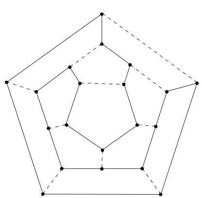
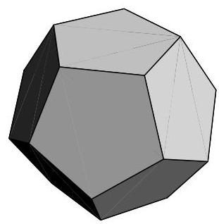

I.11. Graphes hamiltoniens

par Sir W. R. Hamilton qui concerne cette fois l'existence d'un circuit passant une et une seule fois par chaque sommet $^{30}$  de  $G$ . Il est frappant de constater qu'il n'existe, à ce jour, pas de méthode efficace $^{31}$  permettant de répondre à cette question. Un chemin (resp. circuit) passant une et une seule fois par chaque sommet de  $G$  sera qualifié d'hamiltonien. Un graphe hamiltonien est un graphe possédant un circuit hamiltonien $^{32}$ .

Exemple I.11.1. On considère un dodécaèdre régulier (polyèdre régulier possédant 12 faces pentagonales et 20 sommets). Le graphe associé, ou squelette, (on procède comme à l'exemple I.3.3) est représenté à la figure I.65. La question originale posée par Hamilton était de déterminer un circuit passant une et une seule fois par chaque arête de ce graphe.

FIGURE I.65. Squelette d'un dodécaèdre et circuit hamiltonien.

Exemple I.11.2. Sur un échiquier, le cavalier se déplace de deux cases dans une direction (horizontale ou verticale) puis d'une case dans une direction orthogonale. Est-il possible qu'un cavalier passé par toutes les cases de l'échiquier sans passer deux fois par la même case et revenir à son point de départ. Il s'agit encore de la recherche d'un circuit hamiltonien. On peut considérer un graphe dont les sommets représentent les cases de l'échiquier et une arête joint deux sommets si et seulement si un cavalier peut passer de l'une des cases correspondantes à la suivante en un mouvement. (Ainsi,