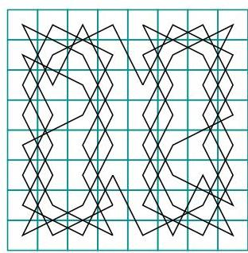
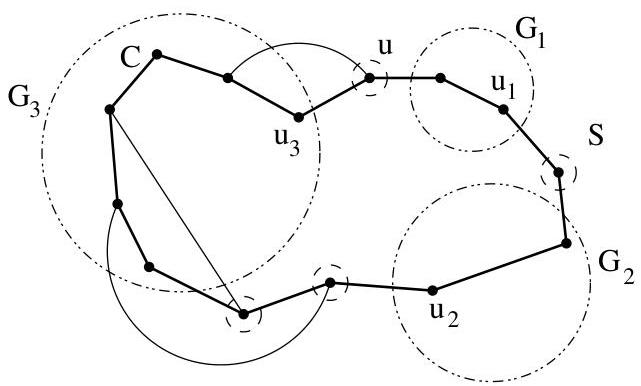

Chapitre I. Premier contact avec les graphes

le degré de chaque sommet varie entre 2 et 8). On peut répondre affirmativement à cette question comme le prouve la figure I.66.

FIGURE I.66. Déplacement d'un cavalier.

Voici une première condition nécessaire pour qu'un graphe soit hamiltonien.

Proposition I.11.3. Si  $G = (V, E)$  est un graphe (simple et non orienté) hamiltonien, alors pour tout ensemble non vide  $S \subseteq V$ , le nombre de composantes connexes de  $G - S$  est inférieur ou égal à #S.

Démonstration. Soit  $S$  un sous-ensemble non vide de  $V$  et  $u$  un sommet de  $S$ . Considérons un circuit hamiltonien  $C$  passant par  $u$ . On peut voir  $C$  comme une suite ordonnée de sommets  $(u, w_1, \ldots, w_{n-1}, u)$ . Soient  $G_1, \ldots, G_k$ , les  $k$  composantes connexes de  $G - S$ . Si  $k = 1$ , le résultat est trivial. Supposons donc  $k &gt; 1$ . Pour  $i = 1, \ldots, k$ , désignons par  $u_i$  le dernier sommet de  $G_i$  dans le circuit  $C$  et  $v_i$ , le sommet suivant  $u_i$  dans ce même circuit. Les sommets  $v_1, \ldots, v_k$  appartiennent à  $S$ . En effet, on a un cycle passant par tous les sommets du graphe et on sait que la suppression des sommets de  $S$  disconnect le graphe en  $k$  composantes. Par définition de

FIGURE I.67. Une illustration de la preuve de la proposition I.11.3.