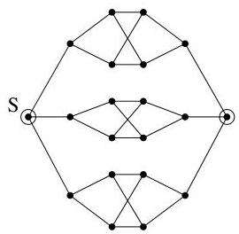
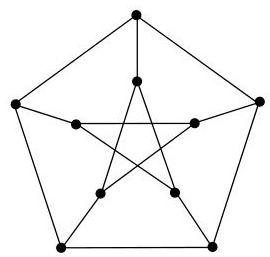

I.11. Graphes hamiltoniens

ces composantes et des sommets  $u_{i}$  et  $v_{i}$ , on en conclus $^{33}$  que  $v_{1}, \ldots, v_{k}$  sont des sommets distincts de  $S$  et donc  $\# S \geq k$ .

Exemple I.11.4. Ce premier résultat peut être utilisé pour vérifier que certains graphes ne sont pas hamiltoniens. Par exemple, le graphe de la figure I.68 ne vérifie pas la condition de la proposition précédente pour l'ensemble  $S$  constitué des deux sommets encerclés. En effet, en supprimant ces deux sommets, on obtient trois composantes connexes.

FIGURE I.68. Un graphe non hamiltonien.

Par contre, cette condition n'est pas suffisante. En effet, le graphe de Petersen (figure I.69) la vérifie et pourtant, ce dernier n'est pas hamiltonien (les vérifications sont laissées au lecteur). Le graphe de Petersen est souvent utilisé comme contre-exemple classique en théorie des graphes pourmettre en défaut certaines propriétés non généralisables.

FIGURE I.69. Le graphe de Petersen.

On dispose de plusieurs conditions suffisantes (theorèmes de Dirac, de Chvátal, ou encore de Chvátal-Erdős) pour assurer qu'un graphe est hamiltonien. On supposera toujours le graphe simple et non orienté. La première de ces conditions est une condition locale, elle exprime que si chaque sommet a suffisamment de voisins, alors le graphe est hamiltonien. Pour rappel, la