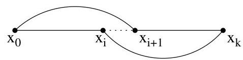

Chapitre I. Premier contact avec les graphes

partie entière par excès (resp. par défaut) d'un réel  $x$  est  $\lceil x \rceil = \inf \{y \in \mathbb{Z} \mid y \geq x\}$  (resp.  $\lfloor x \rfloor = \sup \{y \in \mathbb{Z} \mid y \leq x\}$ ).

Théorème I.11.5 (Dirac). Tout graphe  $G$  (simple et non orienté) ayant  $n \geq 3$  sommets et tel que le degré de chaque sommet est au moins égal à  $n/2$ , possède un circuit hamiltonien.

Démonstration. Notons  $\delta = \inf_{v\in V}\deg (v)$ . Puisque  $\delta \geq \lceil n / 2\rceil$ , on en conclus que  $G$  est connexe. En effet, si ce n'était pas le cas,  $G$  possèderait au moins deux composantes connexes distinctes dont une contient  $\leq \lfloor n / 2\rfloor$  sommets $^{34}$ . Or si  $\delta \geq \lceil n / 2\rceil$ , alors un des sommets de cette composante doit être voisin d'un sommet d'une autre composante, ce qui n'est pas possible (vu la maximalité des composantes connexes).

Soit  $C$  un chemin de longueur maximale passant par des sommets tous distincts (i.e., un chemin simple). Puisque  $G$  est simple,  $C$  est entièrement défini par une suite de sommets  $x_0, \ldots, x_k$ . Par maximalité, tous les voisins de  $x_0$  et de  $x_k$  appartiennent à  $C$  (en effet, sinon, on pourrait étendre  $C$  en un chemin plus long). Par conséquent, au moins  $\lceil n/2 \rceil$  sommets parmi  $x_0, \ldots, x_{k-1}$  sont voisins de  $x_k$  et au moins  $\lceil n/2 \rceil$  sommets parmi  $x_1, \ldots, x_k$  sont voisins de  $x_0$ . De plus,  $k+1 \leq n$  (ou encore  $k &lt; n$ ). Par conséquent $^{35}$ , il existe un indice  $i &lt; k$  tel que

$$
\{x _ {0}, x _ {i + 1} \} \in E \quad \text {e t} \quad \{x _ {i}, x _ {k} \} \in E.
$$

Ainsi,

$x_0,x_1,\ldots ,x_i,x_k,x_{k - 1},\ldots ,x_{i + 2},x_{i + 1},x_0$

est un circuit passant une seule fois par chacun des sommets  $x_0, \ldots, x_k$ . Ce circuit est hamiltonien. En effet, supposons qu'il existe un sommet  $y$  n'appartenant pas à ce circuit. Puisque  $G$  est connexe, il existe  $j \in \{0, \ldots, k\}$  tel que  $\{x_j, y\} \in E$ . De là, on peut construire un chemin passant par  $k + 2$  sommets distincts. C'est impossible vu le choix de  $C$  (de longueur maximale).