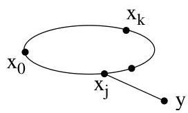
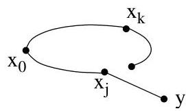

I.11. Graphes hamiltoniens

Le théorème suivant, premier théorème d'Ore, sera utilisé pour prouver le théorème de Chvátal (condition suffisante à ce jour la plus aboutie pour assurer qu'un graphe soit hamiltonien).

En particulier, l'idée d'adjoindre des arêtes à un graphe va nous fournir, à la section suivante, la notion importante de fermeture d'un graphe. On peut d'ores et déjà remarquer que l'adjonction d'une arête  $\{x,y\}$  est réalisée quand  $\deg (x) + \deg (y)\geq \# V$

Enfin, nous attendrons la formulation du corollaire I.11.7, le deuxième théorème d'Ore, pour obtenir une condition suffisante assurant le caractère hamiltonien plus générale que celle donnée par le théorème de Dirac.

Théorème I.11.6 ("premier" Théorème d'Ore). Soient  $G = (V, E)$  un graphe (simple et non orienté) ayant  $n \geq 3$  sommets et  $x$  et  $y$  deux sommets tels que  $\deg(x) + \deg(y) \geq n$ . Le graphe  $G$  est hamiltonien si et seulement si le graphe  $G + \{x, y\}$  l'est.

Démonstration. Si l'arête  $e = \{x, y\}$  appartient à  $E$ , il n'y a rien à démontré. Nous allons donc supposer que cette arête n'appartient pas à  $G$ . De plus, la condition est triviallement nécessaire.

Supposons donc que le graphe  $G + \{x, y\}$  possède un circuit hamiltonien  $C$  passant par l'arête  $e = \{x, y\}$ . En effet, si le circuit hamiltonien ne passse pas par  $e$ , il n'y a rien non plus à démontré. Ainsi, le circuit  $C$  peut s'écrire comme une suite ordonnée de sommets (tous distincts exceptées les deux copies de  $x$ )

$$
C = (v _ {1} = x, v _ {2}, \dots , v _ {n} = y, x).
$$

Il existe  $i$  tel que  $1 &lt; i &lt; n$ ,  $\{x, v_i\} \in E$  et  $\{v_{i-1}, y\} \in E$ : c'est une conséquence de l'hypothèse  $\deg(x) + \deg(y) \geq n$  (et c'est le même genre d'argument $^{36}$  que dans le théorème de Dirac). On en déduit (cf. figure I.70) que

$$
\left(v _ {i}, v _ {i + 1}, \dots , y, v _ {i - 1}, v _ {i - 2}, \dots , x, v _ {i}\right)
$$

est un circuit hamiltonien dans  $G$  (puisqu'il ne fait plus intervenir l'arête  $e$ ).

On utilise ce résultat pour démontré le théorème I.11.12.