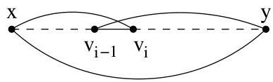

Chapitre I. Premier contact avec les graphes

FIGURE I.70. Théorème d'Ore, circuit dans  $G$ .

Nous verrons rapidement que ce théorème permet d'obtenir facilement le résultat suivant (nous pourrions d'ailleurs en donner une preuve directement mais pour éviter les redondances, nous la postposons).

Corollaire I.11.7 ("deuxieme" Théorème d'Ore). Soit  $G = (V, E)$  un graphe (simple et non orienté) ayant  $n \geq 3$  sommets. Si pour tout couple de sommets non adjacents  $(x, y)$ , on a  $\deg(x) + \deg(y) \geq n$ , alors  $G$  est hamiltonien. En particulier, si  $\min_{v \in V} \deg(v) \geq n/2$ , alors  $G$  est hamiltonien.

Remarque I.11.8. On peut observer que le théorème de Dirac est un corollaire immédiat du deuxième théorème d'Ore. En effet, si pour chaque sommet  $\deg(v) \geq n/2$ , alors pour toute paire de sommets  $x$  et  $y$ , on a triviallement  $\deg(x) + \deg(y) \geq n$ .

Remarque I.11.9. Il est à noter que chronologiquement, c'est d'abord le théorème de Dirac qui fut obtenu (1952), puis celui d'Ore (1960) et enfin celui de Chvátal (1971).

11.1. Fermeture d'un graphe et théorème de Chvátal. Introduisons tout d'abord la fermetre d'un graphe simple et non orienté. Soit  $G_0 = (V_0, E_0)$  un graphe simple et non orienté. On définit une suite finie

$$
G _ {0}, G _ {1}, \dots , G _ {i} = (V _ {i}, E _ {i}), \dots , G _ {k}
$$

de graphes (simples) de la manière suivante. Pour tout  $i$ , on ajoute à  $G_{i}$  une arête comme suit:

$$
G _ {i + 1} = G _ {i} + \{u, v \}
$$

ou  $u$  et  $v$  sont des sommets de  $G_{i}$  qui sont tels que  $\{u,v\} \notin E_i$  et

$$
\deg_ {G _ {i}} (u) + \deg_ {G _ {i}} (v) \geq \# V
$$

ou  $\deg_{G_i}$  désigne bien sur le degré d'un sommet dans le graphe  $G_i$ . La procédure s'arrête lorsqu'il n'y a plus moyen d'ajouter de nouvelles arêtes à  $G_k$ . Ainsi, pour tous sommets  $u, v$ , soit  $\{u, v\}$  appartient à  $E_k$ , soit  $\deg_{G_k}(u) + \deg_{G_k}(v) &lt; \# V$ . Le graphe obtenu à la dernière étape s'appelle la fermetre de  $G_0$ . Nous allons tout d'abord montré que quels que soient les choix d'arêtes réalisés dans les étapes intermédiaires, on aboutit toujours au même graphe (ainsi la définition est bien licite) noté  $\mathcal{F}(G_0)$ .

Exemple I.11.10. A la figure I.71, on a considéré deux graphes et leur fermetre. A chaque fois, on a noté le degré des sommets considérés pour l'ajout d'une nouvelle arête. On peut noter que pour le graphe du haut,