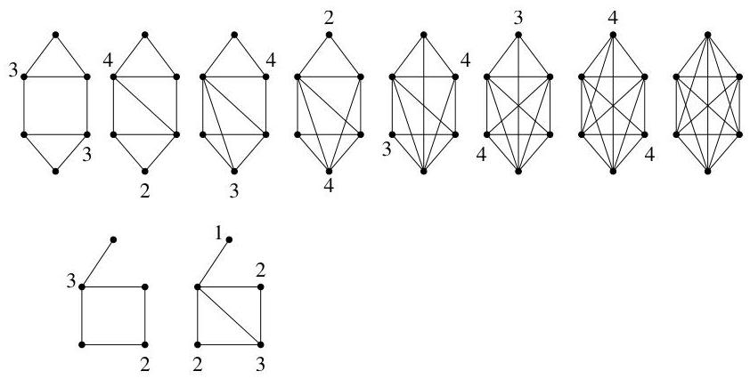

I.11. Graphes hamiltoniens

la fermetre donne le graphe complet  $K_{6}$ , alors que dans le second cas, la couverture n'est pas le graphe complet  $K_{5}$ .

FIGURE I.71. Construction de la fermetre d'un graphe.

Lemma I.11.11. Pour tout graphe ayant au moins trois sommets, la fermetre d'un graphe est unique.

Démonstration. Supposons que  $G$  possède  $n \geq 3$  sommets et qu'il est possible de construire une fermetre de  $G$  en adjoignant de nouvelles arêtes de deux manières distinctes. Ainsi, supposons que

$$
H = G + \left\{e _ {1}, \dots , e _ {r} \right\} \quad \text {e t} \quad H ^ {\prime} = G + \left\{f _ {1}, \dots , f _ {s} \right\}
$$

sont deux fermetres de  $G$ . Nous allons montré que  $H = H'$ . On note  $H_{i} = G + \{e_{1},\ldots ,e_{i}\}$  et  $H_{i}^{\prime} = G + \{f_{1},\ldots ,f_{i}\}$ . On a  $G = H_0 = H_0'$ . Si  $H\neq H'$ , il y a au moins une arête de l'un qui n'est pas dans l'autre. Supposons que  $e_k = \{u,v\}$  est la première arête de  $H$  qui n'appartient pas à  $H^{\prime}$ . (Ainsi,  $e_1,\dots ,e_{k - 1}$  sont des arêtes de  $H^{\prime}$  et  $e_k$  diffère de tous les  $f_{i}$ .) Puisque  $e_k$  est l'arête ajoutée à  $H_{k - 1}$  pour construire  $H_{k}$ , on a que

$$
\deg_ {H _ {k - 1}} (u) + \deg_ {H _ {k - 1}} (v) \geq n.
$$

Il est clair que  $H_{k - 1}$  est un sous-graphe de  $H^{\prime}$ . De là, on en conclus que

$$
\deg_ {H ^ {\prime}} (u) + \deg_ {H ^ {\prime}} (v) \geq n
$$

et donc, l'arête  $e_k$  devra aussi être ajoutée à  $H'$ , une contradiction. Par conséquent,  $H$  est un sous-graphe de  $H'$  et par symétrie, on en tire que  $H = H'$ .

Le théorème suivant est en fait une simple conséquence du (premier) théorème d'Ore.

Théorème I.11.12. Soit  $G$  un graphe (simple et non orienté) ayant au moins trois sommets.