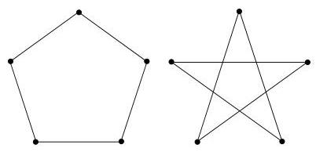
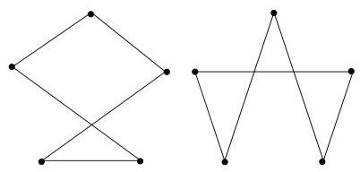

Chapitre I. Premier contact avec les graphes

$\deg (u)\leq \deg (v)$  et on en tire que  $\deg (u) &lt;   n - i$  . En conclusion, on a donc  $n - i$  sommets de degre  $&lt;  n - i$  et  $\deg (v_{n - i}) &lt;   n - i$  ce qui contredit (2).

Enfin, citons sans démonstration un dernier résultat concernant les graphes hamiltoniens.

Théorème I.11.17 (Chvátal-Erdős). Soient  $G$  un graphe simple et non orienté ayant au moins trois sommets,  $\alpha(G)$  le nombre maximal de sommets indépendants et  $\kappa(G)$  la taille minimale d'un ensemble d'articulation. Si  $\kappa(G) \geq \alpha(G)$ , alors  $G$  est hamiltonien.

Démonstration. Voir par exemple, R. Diestel, page 277.

Terminons cette section par le résultat suivant représentant un certain intérêt pour le problème du voyageur de commerce. Supposons disposer de  $n$  villes et de connections entre toutes ces villes. On supposera que tous les coûts de connexion d'une ville à une autre sont identiques (ainsi, toute permutation des  $n$  villes fournit une solution optimale). On est donc en présence du graphe complet  $K_{n}$ . Le voyageur de commerce désire passer une et une seule fois par chacune des villes et revenir à son point de départ (le siège de sa compagnie par exemple). Il est clair qu'une permutation quelconque des  $n - 1$  sommets du graphe (siège de la compagnie exclu) répond à la question. Cependant, on peut imaginer qu'il ne désire pas repasser par une route déjà empruntée précédemment. De cette manière, il pourra joindre l'utile à l'agréable en visitant la région de diverses manières. Ainsi, on désire non seulement construire un circuit hamiltonien mais de plus, on voudrait trouver un nombre maximum de tels circuits n'ayant aucune arête commune.

FIGURE I.72. Deux circuits hamiltoniens disjoints de  $K_{5}$ .

FIGURE I.73. Deux autres circuits hamiltoniens disjoints de  $K_{5}$ .