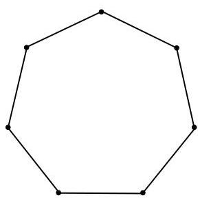
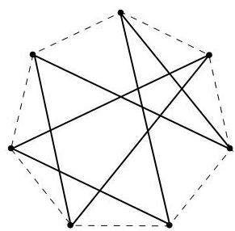
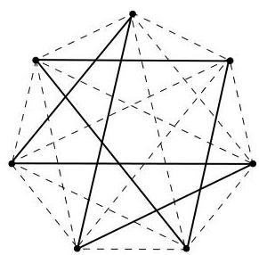

I.11. Graphes hamiltoniens

FIGURE I.74. Un tentative de partition de  $K_{7}$ .

Proposition I.11.18. Pour  $n \geq 3$ ,  $K_{n}$  peut être partitionné en circuits hamiltoniens disjoints si et seulement si  $n$  est impair. En particulier, le nombre de circuits formant une partition de  $K_{n}$  vaut  $(n - 1)/2$ .

Démonstration. Nous savons que  $K_{n}$  est  $(n - 1)$ -régulier (i.e., le degré de chaque sommet vaut  $n - 1$ ). De plus, un circuit hamiltonien est 2-régulier. Par conséquent, il est nécessaire que  $n - 1$  soit pair pour pouvoir décomposer  $K_{n}$  en cycles hamiltoniens disjoints. (Sinon, certaines arêtes, une par sommet, ne feraient partie d'aucun cycle).

Supposons à présent  $n$  impair. Il est évident que  $K_{n}$  peut être décomposé en au plus  $(n - 1) / 2$  circuits hamiltoniens disjoints. En effet, on sélectionne d'abord un premier cycle hamiltonien formé de  $n$  arêtes (on a donc sélectionné deux arêtes incidentes à chaque sommet). Pour le second cycle de  $K_{n}$ , puisque celui-ci doit être disjoint du précédent, le choix se restreint (ce可以选择 correspond encore une fois à sélectionner deux arêtes incidentes à chaque sommet parmi les arêtes non déjà sélectionnées). Puisque chaque cycle可以选择 sélectionner deux arêtes par sommet et que  $K_{n}$  est  $(n - 1)$ -régulier, on ne peut sélectionner qu'au maximum  $(n - 1) / 2$  circuits hamiltoniens disjoints. Notons que la construction d'exactement  $(n - 1) / 2$  circuits disjoints peut a priori être réalisée de plusieurs façon ( comme le montrent les figures I.72 et I.73).

A ce stade, le lecteur ne doit pas être convaincu (en effet, rien n'assure a priori que la procédure proposée fournit le résultatannoncé; le lecteur pourrait objecter qu'à une étape intermédiaire, il ne soit plus possible de continuer et il aurait tout à fait raison!). Comme le montre la figure I.74, un choix arbitraire de deux arêtes à chaque étape peut mener à l'impossibilité d'obtenir des cycles (la figure de droite montre deux cycles non connexes, l'un de longueur 4 et l'autre de longueur 3).

L'obtention d'exactement  $(n - 1) / 2$  circuits hamiltoniens est assurée par les deuxlemmes suivants. (Nous nous basons sur les constructions de Bollobás en donnant en plus des arguments géométriques.)

Lemma I.11.19. Si  $n$  est pair,  $K_{n}$  peut être partitionné en  $n/2$  chemins hamiltoniens disjoints.