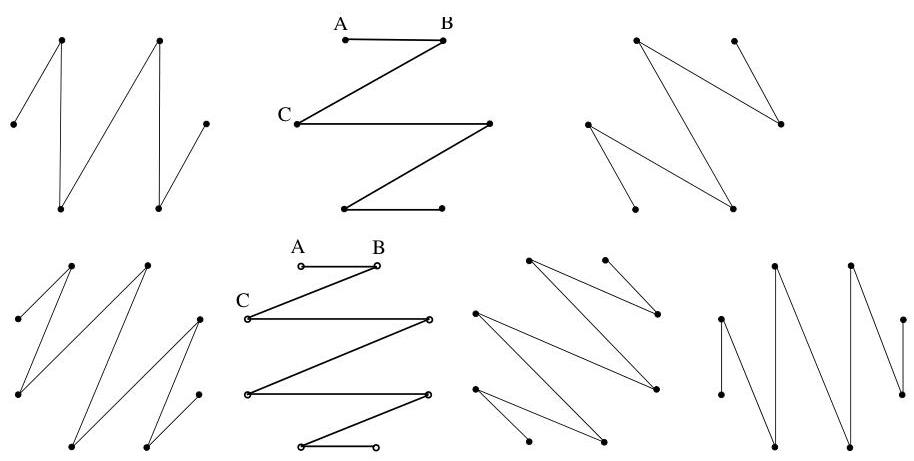

Chapitre I. Premier contact avec les graphes

FIGURE I.75. Chemins hamiltoniens disjoints de  $K_{6}$  et  $K_{8}$ .

Pour prouver ce résultat, on peut considérer des arguments géométriques. On peut identifier les sommets de  $K_{n}$  avec les sommets d'un polygone régulier à  $n$  cots possédant une symétrie orthogonale par rapport à une horizontale (autrement dit, possédant deux cots horizontaux). On obtient un chemin hamiltonien  $\mathcal{C}$  en reliant les sommets se trouvant sur une même horizontale et en reliant le sommet gauche du niveau horizontal  $i$  avec le sommet de droite de niveau  $i + 1$ . On remarque $^{38}$  que toutes ces arêtes "obliques" ont une même pente  $\pi / n$  (c'est-à-dire mesure de l'angle qu'elles forment avec une horizontale). Nous affirmons qu'en effectuant une rotation de la figure  $\mathcal{C}$  de  $2k\pi / n$ ,  $k = 1, \ldots, n/2 - 1$ , on obtient  $n/2$  chemins hamiltoniens distincts. Pour vérifier qu'ils sont tous distincts, il suffit de raisonner sur la pente respective des arêtes les constituant. Une illustration est fournie à la figure I.75. En effet, pour  $\mathcal{C}$ , les arêtes "obliques" ont pour pente  $\pi / n$ , puis en effectuant les rotations on obtient les pentes distinctes  $3\pi / n$ ,  $5\pi / n$ , ...,  $(1 - 1/n)\pi$ .

Lemma I.11.20. Soit  $n \geq 3$  impair. Le graphe  $K_{n}$  peut être partitionné en  $(n - 1) / 2$  circuits hamiltoniens disjoints si et seulement si  $K_{n - 1}$  peut être partitionné en  $(n - 1) / 2$  chemins hamiltoniens disjoints.

Le résultat est presque immédiat. Si  $K_{n}$  peut être partitionné et qu'on lui supprime un sommet, on passes à  $K_{n-1}$  et chaque circuit hamiltonien  $C$  donne naissance à un chemin hamiltonien (les extrémités du chemin étant les sommets voisins dans  $C$  du sommet supprimé). Réciproquement, si  $K_{n-1}$  est partitionné, l'adjonction d'un sommet permet de passer à  $K_{n}$  en "ferment" chaque chemin hamiltonien pour obtenir des circuits disjoints.