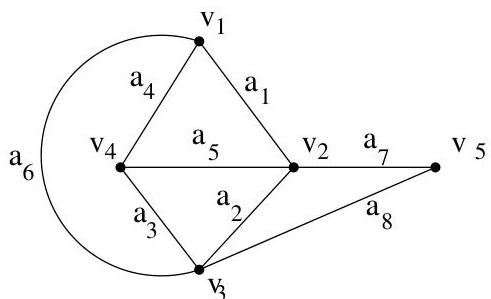

Chapitre II. Un peu de théorie algébrique des graphes

FIGURE II.1. Un graphe  $G$  et sa matrice d'adjacence.

$$
A (G) = \left( \begin{array}{c c c c c} 0 &amp; 1 &amp; 1 &amp; 1 &amp; 0 \\ 1 &amp; 0 &amp; 1 &amp; 1 &amp; 1 \\ 1 &amp; 1 &amp; 0 &amp; 1 &amp; 1 \\ 1 &amp; 1 &amp; 1 &amp; 0 &amp; 0 \\ 0 &amp; 1 &amp; 1 &amp; 0 &amp; 0 \end{array} \right)
$$

det  $A(G_{1}) = \operatorname *{det}A(G_{2})$

Autrement dit, il existe une matrice de permutation  $P$  telle que

$$
A (G _ {1}) = P ^ {- 1} A (G _ {2}) P.
$$

Démonstration. C'est immédiat et ce résultat est même transposable au cas de graphes orientés.

Definition II.1.5. On peut aussi définir la matrice d'incidence "sommets/arêtes". Si  $V = \{v_{1},\ldots ,v_{n}\}$  et  $E = \{e_1,\dots ,e_m\}$ , il s'agit d'une matrice  $B$  de dimension  $n\times m$  telle que  $B_{i,j} = 1$  si et seulement si  $e_j$  est incident à  $v_{i}$ . En poursuivant l'exemple précédent, cette matrice vaut ici

|  1 | 0 | 0 | 1 | 0 | 1 | 0 | 0  |
| --- | --- | --- | --- | --- | --- | --- | --- |
|  1 | 1 | 0 | 0 | 1 | 0 | 1 | 0  |
|  0 | 1 | 1 | 0 | 0 | 1 | 0 | 1  |
|  0 | 0 | 1 | 1 | 1 | 0 | 0 | 0  |
|  0 | 0 | 0 | 0 | 0 | 0 | 1 | 1  |

Definition II.1.6. Dans un graphe simple, on appelle triangle, tout triplet d'arêtes distinctes deux à deux de la forme  $\{a,b\}$ ,  $\{b,c\}$ ,  $\{c,a\}$  (i.e., tout circuit de longueur trois formé d'arêtes distinctes).

Proposition II.1.7. Si le polynôme caractéristique de  $G = (V, E)$  est de la forme

$$
\chi_ {G} (\lambda) = (- \lambda) ^ {n} + c _ {1} (- \lambda) ^ {n - 1} + c _ {2} (- \lambda) ^ {n - 2} + \dots + c _ {n},
$$

alors certains coefficients de  $\chi_G$  sont en relation directe avec  $G$  :

-  $c_1$  est le nombre de boucles de  $G$ , en particulier, si  $G$  est simple,  $c_1 = 0$ .
Si  $G$  est simple, alors  $-c_{2}$  est le nombre d'arêtes de  $G$ .
Si  $G$  est simple, alors  $c_{3}$  est le double du nombre de triangles de  $G$

Démonstration. Le premier point est immédiat. Le coefficient  $c_{1}$  est la somme des éléments diagonaux de  $A_{G}$ . Si  $G$  est simple, les sous-matrices