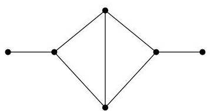
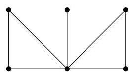

II.1. Matrice d'adjacence

diagonales $^2$  de  $A_G$  de dimension 2 sont de la forme

$$
\left( \begin{array}{c c} 0 &amp; 1 \\ 1 &amp; 0 \end{array} \right) \quad \text {o u} \quad \left( \begin{array}{c c} 0 &amp; 0 \\ 0 &amp; 0 \end{array} \right).
$$

Le coefficient  $c_{2}$  étant la somme des déterminants de ces sous-matrices ceuxci valant respectivement -1 et 0, il est clair que  $c_{2} = -\# E$ . Pour le dernier point, on raisonne de la même façon. Les sous-matrices diagonales non nulles de  $A_{G}$  de dimension 3 sont d'une des formes suivantes (à une permutation des lignes et des colonnes près, ce qui ne change pas la valeur du déterminant)

$$
\left( \begin{array}{c c c} 0 &amp; 1 &amp; 0 \\ 1 &amp; 0 &amp; 0 \\ 0 &amp; 0 &amp; 0 \end{array} \right), \quad \left( \begin{array}{c c c} 0 &amp; 1 &amp; 1 \\ 1 &amp; 0 &amp; 0 \\ 1 &amp; 0 &amp; 0 \end{array} \right) \quad \text {o u} \quad \left( \begin{array}{c c c} 0 &amp; 1 &amp; 1 \\ 1 &amp; 0 &amp; 1 \\ 1 &amp; 1 &amp; 0 \end{array} \right).
$$

Les deux premières ont un déterminant nul et la troisième a un déterminant égal à 2. Le coefficient  $c_{3}$  étant la somme des déterminants de ces sous-matrices et la dernière matrice correspondant à la présence d'un triangle dans  $G$ , on obtient le résultatannoncé.

Remarque II.1.8. On voit donc que le polynôme caractéristique de  $A(G)$  fournit des renseignements sur le graphe  $G$ . Cependant, deux graphes non isomorphes peuvent avoir le même polynôme caractéristique $^3$ . On parle alors de graphes cospectraux. Par exemple, les deux graphes de la figure II.2 ont le même spectre. En effet, ils ont tous les deux comme polynôme caractéristique,

$$
- 1 + 4 \lambda + 7 \lambda^ {2} - 4 \lambda^ {3} - 7 \lambda^ {4} + \lambda^ {6}.
$$

FIGURE II.2. Deux graphes cospectraux.

Proposition II.1.9. Soit  $G = (V, E)$  un graphe biparti. Si  $\lambda$  est valeur propre de  $G$ , alors  $-\lambda$  l'est aussi. Autrement dit, le spectre d'un graphe biparti est symétrique par rapport à 0.

Démonstration. Par hypothèse,  $V$  se partitionne en deux sous-ensembles  $V_{1}$  et  $V_{2}$  de manière telle que toute arête de  $G$  est de la forme  $\{u,v\}$  avec