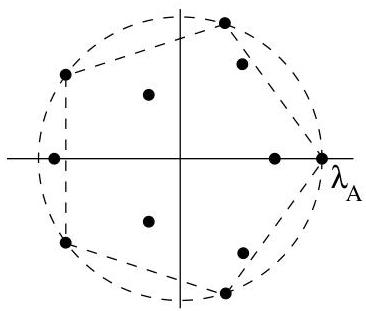
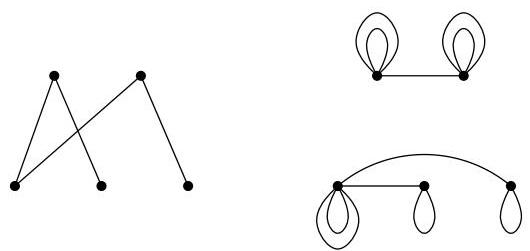

II.2. Théorie de Perron-Frobenius

FIGURE II.3. Disposition des valeurs propres d'une matrice irréductible.

Dans [11]. Enfin, une preuve détaillée et très bien structurée se trouve dans [1] où la théorie de Perron-Frobenius est utilisée dans le cadre des suites automatiques (fréquence d' apparition d'un symbole dans une suite, etc...).

Nous pouvons à présent prouver la reciproque de la proposition II.1.9.

Corollaire II.2.6. Si  $G = (V, E)$  est un graphe (non orienté simple) connexe dont le spectre est symétrique par rapport à 0, alors  $G$  est biparti.

Démonstration. Soient  $\lambda_G$  la valeur propre de Perron de  $G$  et  $x \neq 0$  un vecteur propre associé. Par hypothèse  $-\lambda_G$  est aussi une valeur propre de  $G$  et considérons  $y \neq 0$ , l'un de ses vecteurs propres. Bien évidemment,  $x$  et  $y$  sont linéairement indépendants. Si  $A$  est la matrice d'adjacence de  $G$ ,  $A^2$  est la matrice d'adjacence du multi-graphe  $G' = (V, E')$  où une arête  $\{a, b\}$  appartient à  $E'$  si et seulement si il existe  $c \in V$  tel que  $\{a, c\}$  et  $\{b, c\}$  appartiennent à  $E$ . On pourrait appeler  $G'$ , le graphe des chemins de longueur 2 de  $G$ .

FIGURE II.4. Une illustration des graphes  $G$  et  $G'$ .

Il est clair que  $\lambda_G^2$  est la valeur propre dominante de  $A^2$  et que  $x$  et  $y$  en sont des vecteurs propres. Par conséquent, la multiplicité de  $\lambda_G^2$  est au moins 2 et on en déduit que  $A^2$  ne peut être irreductible (i.e.,  $G'$  n'est pas